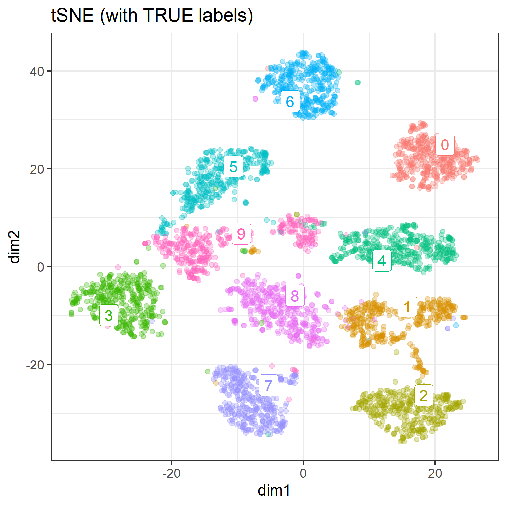
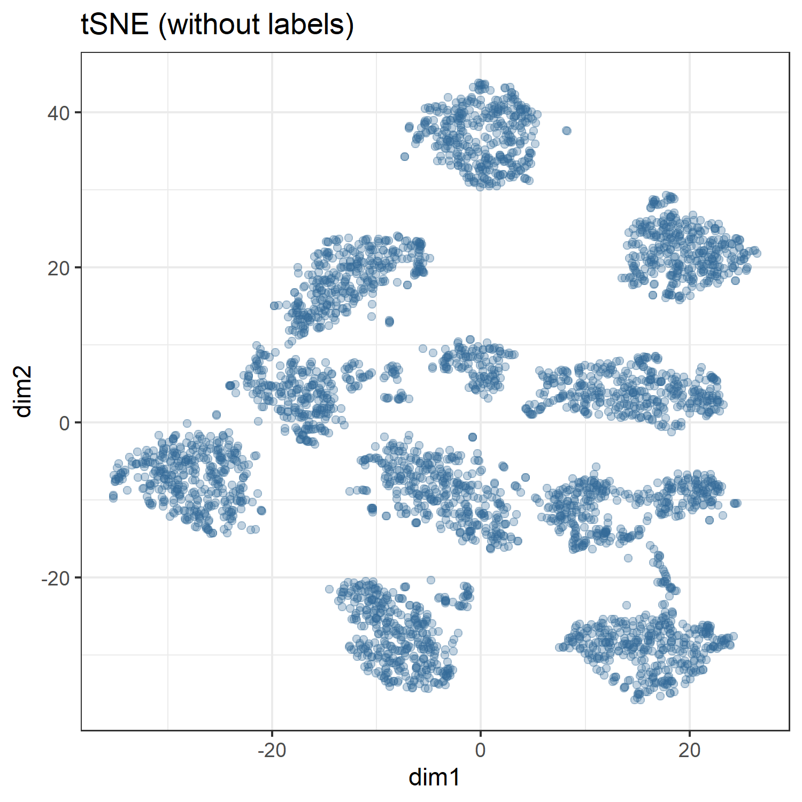
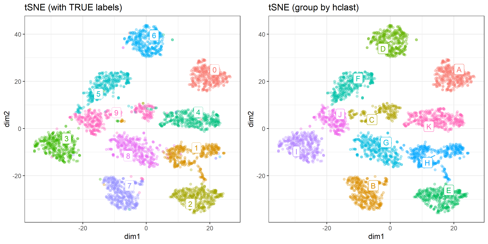

```r
install.packages("Rtsne", dependencies = TRUE)
install.packages("uwot", dependencies = TRUE)
install.packages("ggdendro", dependencies = TRUE)
install.packages("ggrepel", dependencies = TRUE)

```


```r
require(tidyverse)
require(magrittr)
require(xgboost)

require(Rtsne)
require(uwot)
library(ggdendro)
require(ggrepel)
```

# Preparation 

Optical Recognition of Handwritten Digits Data Set

https://archive.ics.uci.edu/ml/datasets/Optical+Recognition+of+Handwritten+Digits


```r
optdigits.tra  <- read.table("./input/optdigits.tra.csv", sep = ",", header = FALSE)

train.label  <- optdigits.tra[, 65]
train.matrix <- optdigits.tra[, -65] %>% as.matrix
```

# dimension reduction using t-SNE

according to :
http://jmonlong.github.io/Hippocamplus/2017/12/02/tsne-and-clustering/


```r
# optdigits %>% str

optdigits.tsne <- train.matrix %>% 
  Rtsne::Rtsne(perplexity = 50, check_duplicates = FALSE)

# optdigits.tsne %>% str

mapping.tsne <- data.frame(
  id    = 1:NROW(optdigits.tsne$Y),
  dim1  = optdigits.tsne$Y[, 1],
  dim2  = optdigits.tsne$Y[, 2],
  label = as.factor(train.label))

labels.cent <- mapping.tsne %>% 
  dplyr::group_by(label) %>%
  select(dim1, dim2) %>% 
  summarize_all(mean)
Adding missing grouping variables: `label`

ggp.tsne <- mapping.tsne %>% 
  ggplot(aes(x = dim1, y = dim2, colour = label)) + 
  geom_point(alpha = 0.3) + 
  theme_bw() +
  ggrepel::geom_label_repel(data = labels.cent,
                            aes(label = label),
                            label.size = 0.1) +
  guides(colour = FALSE) +
  labs(title = "tSNE (with TRUE labels)") 

ggsave(ggp.tsne, filename =  "./output/000_tSNE.png",
       height = 5, width = 5)
```




```r
ggp.tsne.nolabel <- mapping.tsne %>% 
  ggplot(aes(x = dim1, y = dim2, colour = 0)) + 
  geom_point(alpha = 0.3) + 
  theme_bw() +
  guides(colour = FALSE) +
  labs(title = "tSNE (without labels)") 

ggsave(ggp.tsne.nolabel, filename =  "./output/000_tSNE_nolabel.png",
       height = 5, width = 5)
```



## Hierarchical clustering


```r
optdigits.tsne.hc <- mapping.tsne %>% 
  select(-id) %>% 
  as.matrix() %>% 
  dist() %>% 
  hclust()
optdigits.tsne.hc

Call:
hclust(d = .)

Cluster method   : complete 
Distance         : euclidean 
Number of objects: 3823 
```

### explore cut.off for cutree


```r
library(ggdendro)

cut.off = 25

ggd.tsne.hc <- ggdendrogram(optdigits.tsne.hc, rotate = TRUE, size = 2) +
  geom_hline(yintercept = cut.off, color = "red")

ggsave(ggd.tsne.hc, filename =  "./output/000_tsne_hclust.png",
    height = 5, width = 5)
```


```r
require(ggrepel)

mapping.tsne$hclust <- optdigits.tsne.hc %>%
  cutree(h = cut.off) %>%
  factor()

hc.cent <- mapping.tsne %>% 
  group_by(hclust) %>%
  select(dim1, dim2) %>% 
  summarize_all(mean)
Adding missing grouping variables: `hclust`

ggp.tsne.hc <- mapping.tsne %>% 
  ggplot(aes(x = dim1, y = dim2, colour = hclust)) + 
  geom_point(alpha = 0.3) + 
  theme_bw() +
  ggrepel::geom_label_repel(data = hc.cent,
                            aes(label = LETTERS[hclust])) + 
  guides(colour = FALSE) +
  labs(title = "tSNE (group by hclast)") 
```


```r
ggp.tsne.compare <- gridExtra::arrangeGrob(
  grobs = list(
    ggp.tsne, ggp.tsne.hc
  ),
  ncol = 2
)

ggsave(ggp.tsne.compare, filename =  "./output/000_tSNE_compare.png",
       height = 5, width = 10)
```




