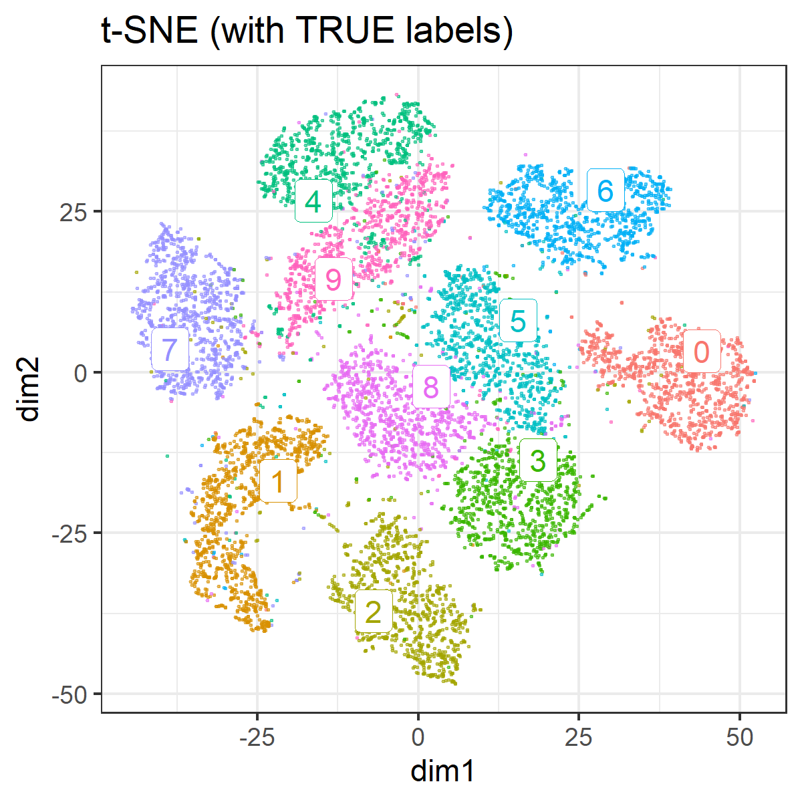
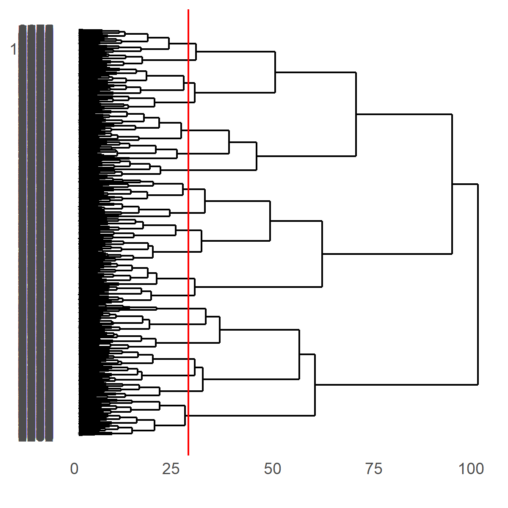

```{r setup, include=FALSE}
knitr::opts_knit$set(progress = TRUE, 
                     verbose  = TRUE, 
                     root.dir = ".")

knitr::opts_chunk$set(collapse = TRUE, 
                      comment = "#> ", 
                      message = TRUE, 
                      warning = FALSE, 
                      include = TRUE,
                      echo    = TRUE)

```

```{r install.requirements, eval = FALSE}
install.packages("Rtsne", dependencies = TRUE)
install.packages("uwot", dependencies = TRUE)
install.packages("ggdendro", dependencies = TRUE)
install.packages("ggrepel", dependencies = TRUE)

```

```{r require.packages, message=FALSE}
require(tidyverse)
require(magrittr)

require(Rtsne)
require(uwot)
library(ggdendro)
require(ggrepel)

```

# Preparation 


Using MNIST (test set) as csv fromat was downloaded from :

https://github.com/pjreddie/mnist-csv-png

```{r}
set.seed(1)

require(tidyverse)
require(Rtsne)
load("./input/mnist_sample.rda")

train.label  <- mnist.sample[,  1]
train.matrix <- mnist.sample[, -1] %>% as.matrix

n <- NROW(train.matrix)
train.matrix %>% str(0)

```

# dimension reduction using t-SNE

according to :
http://jmonlong.github.io/Hippocamplus/2017/12/02/tsne-and-clustering/

```{r}
zeros.col <- which(colSums(train.matrix) == 0)
map.pca <- prcomp(x = train.matrix[, -zeros.col], scale = TRUE)
ggp.pca <- data.frame(
  dim1  = map.pca$x[, 1],
  dim2  = map.pca$x[, 2],
  label = as.factor(train.label)) %>% 
  ggplot(aes(x = dim1, y = dim2, colour = label)) + 
  geom_point(alpha = 0.3, size = 0.2) + 
  theme_bw() +
  guides(colour = FALSE) +
  labs(title = "PCA")

ggsave(ggp.pca, filename =  "./output/000_PCA.png",
       height = 4, width = 4)
```


```{r}
plot.tsne <- function(.tsne, label = NULL, title = "") {
  
  mapping <- data.frame(
    id    = 1:NROW(.tsne$Y),
    dim1  = .tsne$Y[, 1],
    dim2  = .tsne$Y[, 2])
  
  ggp <- mapping %>% 
    ggplot(aes(x = dim1, y = dim2, colour = label)) + 
    geom_point(alpha = 0.5, size = 0.2) + 
    theme_bw() +
    guides(colour = FALSE) +
    labs(title = title)
  
  if(!is.null(label)){
    mapping$label = label
    
    labels.cent <- mapping %>% 
      dplyr::group_by(label) %>%
      select(dim1, dim2) %>% 
      summarize_all(mean)
    
    ggp <- ggp +
      ggrepel::geom_label_repel(data = labels.cent,
                                aes(label = label),
                                label.size = 0.1)
  }
  
  invisible(
    list(
      plot = ggp,
      mapping = mapping
    )
  )
}
```

```{r}
mapping.tsne <- train.matrix %>% 
  Rtsne::Rtsne(verbose = TRUE, num_threads = 4)

```
```{r}
mapping.tsne %>% str()
```

```{r}
mapping <- data.frame(
  id    = 1:NROW(mapping.tsne$Y),
  dim1  = mapping.tsne$Y[, 1],
  dim2  = mapping.tsne$Y[, 2],
  label = as.factor(train.label))

ggp <- mapping %>% 
  ggplot(aes(x = dim1, y = dim2, colour = label)) + 
  geom_point(alpha = 0.5, size = 0.2) + 
  theme_bw() +
  guides(colour = FALSE) +
  labs(title = "t-SNE (with TRUE labels)")

labels.cent <- mapping %>% 
  dplyr::group_by(label) %>%
  select(dim1, dim2) %>% 
  summarize_all(mean)
    
ggp.tsne <- ggp +
  ggrepel::geom_label_repel(
    data = labels.cent,
    aes(label = label),
    label.size = 0.1)

ggp.tsne

ggsave(ggp.tsne, filename =  "./output/000_t-SNE.png",
       height = 4, width = 4)

```



```{r}
ggp.tsne.nolabel <- mapping.tsne %>% 
  plot.tsne(
    # label = as.factor(train.label),
    title = "t-SNE (without labels)")
# mapping.tsne %>% str
# ggp.tsne.nolabel$plot

ggsave(ggp.tsne.nolabel$plot, filename =  "./output/000_t-SNE_nolabel.png",
       height = 4, width = 4)

```


# Hierarchical clustering

```{r }
mapping.tsne.hc <- ggp.tsne.nolabel$mapping %>% 
  select(-id) %>% 
  as.matrix() %>% 
  dist() %>% 
  hclust()
mapping.tsne.hc
```

## explore cut.off for cutree

```{r}
library(ggdendro)

cut.off = 27

ggdend.tsne.hc <- ggdendrogram(mapping.tsne.hc, rotate = TRUE, size = 2) +
  geom_hline(yintercept = cut.off, color = "red")

ggsave(ggdend.tsne.hc, filename =  "./output/000_tsne_hclust.png",
       height = 4, width = 4)

group.by.hclust <- mapping.tsne.hc %>%
  cutree(h = cut.off) %>%
  factor()


```



```{r}
ggp.tsne.hc <- mapping.tsne %>% 
  plot.tsne(
    label = as.factor(LETTERS[group.by.hclust]),
    title = "t-SNE (group by hclust)")

# ggp.tsne.hc$plot

```

```{r, results="hide"}
ggp.tsne.compare <- gridExtra::arrangeGrob(
  grobs = list(
    ggp.tsne, ggp.tsne.hc$plot
  ),
  ncol = 2
)

ggsave(ggp.tsne.compare, filename =  "./output/000_t-SNE_compare.png",
       height = 4, width = 8)

```


