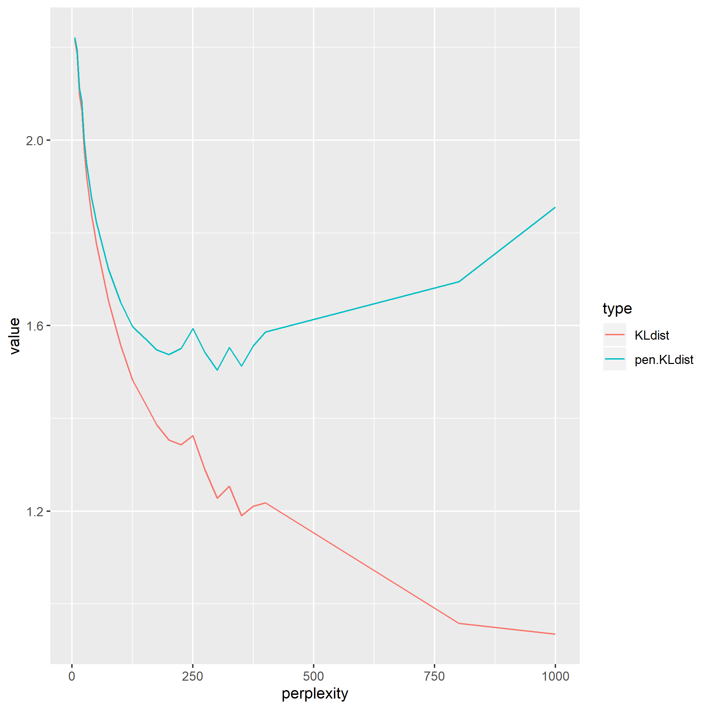
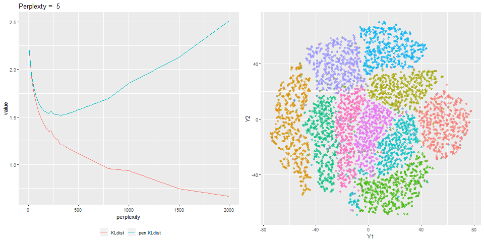

```{r setup, include=FALSE}
knitr::opts_chunk$set(
  collapse = TRUE,
  comment = "#>",
  message = FALSE
)
```


# Overview

Reporoducible check for Cao and Wang (2017) "Automatic Selection of t-SNE Perplexity".

## reference

JMLR: Workshop and Conference Proceedings 1:1-7, 2017 ICML 2017 AutoML Workshop
"Automatic Selection of t-SNE Perplexity" 
[https://arxiv.org/abs/1708.03229](https://arxiv.org/abs/1708.03229)


Using MNIST (test set) as csv fromat was downloaded from :

https://github.com/pjreddie/mnist-csv-png

```{r}
set.seed(1)

require(tidyverse)
require(Rtsne)
load("./input/mnist_sample.rda")

train.label  <- mnist.sample[,  1]
train.matrix <- mnist.sample[, -1] %>% as.matrix

n <- NROW(train.matrix)
train.matrix %>% str(0)

```

```{r, eval = FALSE}
KL <- NULL
res <- list(NULL)
max.p <- (NROW(train.matrix) -1) / 3

try.p <- c(5 * 1:9, 25 * 2:16, 800, 1000)
# try.p <- c(5, 10)
for(i in 1:length(try.p)){
  p <- try.p[i]
  cat("\n\np = ", p, "\n")
  system.time(
    res.tsne <- Rtsne::Rtsne(train.matrix, 
                             verbose = TRUE, 
                             num_threads = 7,
                             perplexity = p)
    # res.tsne <- Rtsne::Rtsne(sample_n(train.matrix, 500), perplexity = p)
  )
  kld <- last(res.tsne$itercosts)
  tmp <- c(
    perplexity = p, 
    KLdist     = kld,
    pen.KLdist = kld + log(n) * p/n)
  
  KL <- rbind(KL, tmp)
  cat(tmp, "\n")
  
  res[[i]] <- data.frame(perp = p, Y1 = res.tsne$Y[,1], Y2 = res.tsne$Y[,2], label = train.label)
}

KL %>% str(2)
# res %>% str(2)

saveRDS(list(KL = KL, iter = res), "./output/KLD_mnist.Rds")
```
```{r}
rdsobj <- readRDS("./output/KLD_mnist.Rds")
KL <- rdsobj$KL%>% 
  data.frame() 
res <- rdsobj$iter

ggp.pkl <- KL %>% 
  gather(key = "type", value = "value", -perplexity) %>% 
  ggplot(aes(x = perplexity, y = value, colour = type)) +
  geom_line()
    
ggsave(filename = "./output/kl_vs_perp.png")
# res %>% str

```




# plot and animation

```{r}

for(i in 1:NROW(res)){
  this.p = KL$perplexity[i]
  ggp.map.this <- res[[i]] %>% 
    ggplot(aes(x = Y1, y = Y2, color = factor(label))) +
    geom_point(alpha = 0.5, size = 0.2) + 
    theme_bw() +
   labs(title = paste("Perplexty = ", this.p)) +
    theme(legend.position = "none")
  ggsave(filename = sprintf("./output/kl_vs_perp/perp_%04i.png", this.p),
         height = 4, width = 4)
}

```

```{r eval = FALSE}
library(animation)
ani.options(convert='C:/ImageMagick-7.0.8-Q16/convert.exe') 
NROW(res) 
KL %>% str
saveGIF(
  {
    for(i in 1:NROW(res)){
      
      this.p = KL$perplexity[i]
      ggp.pkl.this <- ggp.pkl +
        geom_vline(xintercept = this.p, color = "blue") +
        labs(title = paste("Perplexty = ", this.p)) +
        theme(legend.title=element_blank(),
              legend.position = "bottom")
      
      ggp.map.this <- res[[i]] %>% 
        ggplot(aes(x = Y1, y = Y2, color = factor(label))) +
        geom_point(alpha = 0.5, size = 0.2) + 
        theme_bw() +
        labs(title = "") +
        theme(legend.position = "none")
      # 
      # ggp.sw <- list(ggp.pkl.this, ggp.map.this)
      # 
      gridExtra::grid.arrange(ggp.pkl.this, ggp.map.this, ncol = 2)
      
    }
  }, 
  movie.name = "perp-tsne.gif", 
  interval = 1.5,
  ani.width = 960, 
  ani.height= 480
)

```


