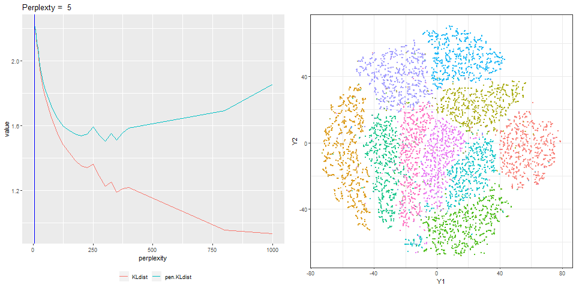

# Overview

Reporoducible check for Cao and Wang (2017) "Automatic Selection of t-SNE Perplexity".

## reference

JMLR: Workshop and Conference Proceedings 1:1-7, 2017 ICML 2017 AutoML Workshop
"Automatic Selection of t-SNE Perplexity" 
[https://arxiv.org/abs/1708.03229](https://arxiv.org/abs/1708.03229)


Using MNIST (test set) as csv fromat was downloaded from :

https://github.com/pjreddie/mnist-csv-png


```r
set.seed(1)

require(tidyverse)
require(Rtsne)
load("./input/mnist_sample.rda")

train.label  <- mnist.sample[,  1]
train.matrix <- mnist.sample[, -1] %>% as.matrix

n <- NROW(train.matrix)
train.matrix %>% str(0)
#>  int [1:10000, 1:784] 0 0 0 0 0 0 0 0 0 0 ...
#>  - attr(*, "dimnames")=List of 2
```


```r
KL <- NULL
res <- list(NULL)
max.p <- (NROW(train.matrix) -1) / 3

try.p <- c(5 * 1:9, 25 * 2:16, 800, 1000, 1500, 2000)
# try.p <- c(5, 10)
for(i in 1:length(try.p)){
  p <- try.p[i]
  system.time(
    res.tsne <- Rtsne::Rtsne(train.matrix, 
                             verbose = TRUE, 
                             num_threads = 5,
                             perplexity = p)
    # res.tsne <- Rtsne::Rtsne(sample_n(train.matrix, 500), perplexity = p)
  )
  kld <- last(res.tsne$itercosts)
  tmp <- c(
    perplexity = p, 
    KLdist     = kld,
    pen.KLdist = kld + log(n) * p/n)
  
  KL <- rbind(KL, tmp)
  cat(tmp, "\n")
  
  
  res[[i]] <- data.frame(perp = p, Y1 = res.tsne$Y[,1], Y2 = res.tsne$Y[,2], label = train.label)
}
#> Performing PCA
#> Read the 10000 x 50 data matrix successfully!
#> OpenMP is working. 5 threads.
#> Using no_dims = 2, perplexity = 5.000000, and theta = 0.500000
#> Computing input similarities...
#> Building tree...
#>  - point 10000 of 10000
#> Done in 1.72 seconds (sparsity = 0.002102)!
#> Learning embedding...
#> Iteration 50: error is 118.269782 (50 iterations in 0.80 seconds)
#> Iteration 100: error is 106.281621 (50 iterations in 0.91 seconds)
#> Iteration 150: error is 99.722062 (50 iterations in 0.80 seconds)
#> Iteration 200: error is 97.004131 (50 iterations in 0.86 seconds)
#> Iteration 250: error is 95.361119 (50 iterations in 0.85 seconds)
#> Iteration 300: error is 4.384579 (50 iterations in 0.80 seconds)
#> Iteration 350: error is 3.830215 (50 iterations in 0.83 seconds)
#> Iteration 400: error is 3.471228 (50 iterations in 0.87 seconds)
#> Iteration 450: error is 3.210250 (50 iterations in 0.92 seconds)
#> Iteration 500: error is 3.009064 (50 iterations in 0.91 seconds)
#> Iteration 550: error is 2.848844 (50 iterations in 0.91 seconds)
#> Iteration 600: error is 2.717645 (50 iterations in 0.96 seconds)
#> Iteration 650: error is 2.608668 (50 iterations in 0.96 seconds)
#> Iteration 700: error is 2.516832 (50 iterations in 0.93 seconds)
#> Iteration 750: error is 2.440141 (50 iterations in 0.95 seconds)
#> Iteration 800: error is 2.376660 (50 iterations in 0.94 seconds)
#> Iteration 850: error is 2.323174 (50 iterations in 0.96 seconds)
#> Iteration 900: error is 2.279061 (50 iterations in 0.89 seconds)
#> Iteration 950: error is 2.243557 (50 iterations in 0.94 seconds)
#> Iteration 1000: error is 2.215779 (50 iterations in 0.94 seconds)
#> Fitting performed in 17.91 seconds.
#> 5 2.215779 2.220384 
#> Performing PCA
#> Read the 10000 x 50 data matrix successfully!
#> OpenMP is working. 5 threads.
#> Using no_dims = 2, perplexity = 10.000000, and theta = 0.500000
#> Computing input similarities...
#> Building tree...
#>  - point 10000 of 10000
#> Done in 2.05 seconds (sparsity = 0.004145)!
#> Learning embedding...
#> Iteration 50: error is 110.372410 (50 iterations in 0.76 seconds)
#> Iteration 100: error is 100.607786 (50 iterations in 0.88 seconds)
#> Iteration 150: error is 94.337127 (50 iterations in 0.74 seconds)
#> Iteration 200: error is 92.606592 (50 iterations in 0.75 seconds)
#> Iteration 250: error is 91.742089 (50 iterations in 0.73 seconds)
#> Iteration 300: error is 3.907850 (50 iterations in 0.67 seconds)
#> Iteration 350: error is 3.407404 (50 iterations in 0.69 seconds)
#> Iteration 400: error is 3.109105 (50 iterations in 0.69 seconds)
#> Iteration 450: error is 2.902353 (50 iterations in 0.72 seconds)
#> Iteration 500: error is 2.746786 (50 iterations in 0.73 seconds)
#> Iteration 550: error is 2.624336 (50 iterations in 0.77 seconds)
#> Iteration 600: error is 2.526291 (50 iterations in 0.79 seconds)
#> Iteration 650: error is 2.446021 (50 iterations in 0.76 seconds)
#> Iteration 700: error is 2.379280 (50 iterations in 0.80 seconds)
#> Iteration 750: error is 2.323914 (50 iterations in 0.79 seconds)
#> Iteration 800: error is 2.280582 (50 iterations in 0.92 seconds)
#> Iteration 850: error is 2.247724 (50 iterations in 0.80 seconds)
#> Iteration 900: error is 2.224349 (50 iterations in 0.82 seconds)
#> Iteration 950: error is 2.206457 (50 iterations in 0.87 seconds)
#> Iteration 1000: error is 2.191644 (50 iterations in 0.88 seconds)
#> Fitting performed in 15.55 seconds.
#> 10 2.191644 2.200854 
#> Performing PCA
#> Read the 10000 x 50 data matrix successfully!
#> OpenMP is working. 5 threads.
#> Using no_dims = 2, perplexity = 15.000000, and theta = 0.500000
#> Computing input similarities...
#> Building tree...
#>  - point 10000 of 10000
#> Done in 1.96 seconds (sparsity = 0.006176)!
#> Learning embedding...
#> Iteration 50: error is 105.684361 (50 iterations in 0.71 seconds)
#> Iteration 100: error is 96.758041 (50 iterations in 0.72 seconds)
#> Iteration 150: error is 91.216738 (50 iterations in 0.71 seconds)
#> Iteration 200: error is 89.846595 (50 iterations in 0.71 seconds)
#> Iteration 250: error is 89.304414 (50 iterations in 0.74 seconds)
#> Iteration 300: error is 3.606732 (50 iterations in 0.70 seconds)
#> Iteration 350: error is 3.143380 (50 iterations in 0.71 seconds)
#> Iteration 400: error is 2.879312 (50 iterations in 0.74 seconds)
#> Iteration 450: error is 2.699184 (50 iterations in 0.72 seconds)
#> Iteration 500: error is 2.567491 (50 iterations in 0.75 seconds)
#> Iteration 550: error is 2.464526 (50 iterations in 0.76 seconds)
#> Iteration 600: error is 2.380448 (50 iterations in 0.79 seconds)
#> Iteration 650: error is 2.312552 (50 iterations in 0.79 seconds)
#> Iteration 700: error is 2.256280 (50 iterations in 0.79 seconds)
#> Iteration 750: error is 2.209316 (50 iterations in 0.77 seconds)
#> Iteration 800: error is 2.170839 (50 iterations in 0.81 seconds)
#> Iteration 850: error is 2.141437 (50 iterations in 0.81 seconds)
#> Iteration 900: error is 2.119748 (50 iterations in 0.83 seconds)
#> Iteration 950: error is 2.103828 (50 iterations in 0.82 seconds)
#> Iteration 1000: error is 2.092218 (50 iterations in 0.92 seconds)
#> Fitting performed in 15.28 seconds.
#> 15 2.092218 2.106033 
#> Performing PCA
#> Read the 10000 x 50 data matrix successfully!
#> OpenMP is working. 5 threads.
#> Using no_dims = 2, perplexity = 20.000000, and theta = 0.500000
#> Computing input similarities...
#> Building tree...
#>  - point 10000 of 10000
#> Done in 2.38 seconds (sparsity = 0.008203)!
#> Learning embedding...
#> Iteration 50: error is 102.335342 (50 iterations in 0.87 seconds)
#> Iteration 100: error is 94.131400 (50 iterations in 0.86 seconds)
#> Iteration 150: error is 89.577231 (50 iterations in 0.84 seconds)
#> Iteration 200: error is 88.350382 (50 iterations in 0.77 seconds)
#> Iteration 250: error is 88.037535 (50 iterations in 0.78 seconds)
#> Iteration 300: error is 3.422966 (50 iterations in 0.74 seconds)
#> Iteration 350: error is 2.979182 (50 iterations in 0.72 seconds)
#> Iteration 400: error is 2.734731 (50 iterations in 0.74 seconds)
#> Iteration 450: error is 2.572914 (50 iterations in 0.74 seconds)
#> Iteration 500: error is 2.453836 (50 iterations in 0.75 seconds)
#> Iteration 550: error is 2.362454 (50 iterations in 0.77 seconds)
#> Iteration 600: error is 2.290692 (50 iterations in 0.81 seconds)
#> Iteration 650: error is 2.233095 (50 iterations in 0.79 seconds)
#> Iteration 700: error is 2.186572 (50 iterations in 0.78 seconds)
#> Iteration 750: error is 2.148382 (50 iterations in 0.79 seconds)
#> Iteration 800: error is 2.119305 (50 iterations in 0.83 seconds)
#> Iteration 850: error is 2.097520 (50 iterations in 0.82 seconds)
#> Iteration 900: error is 2.082716 (50 iterations in 0.81 seconds)
#> Iteration 950: error is 2.072511 (50 iterations in 0.86 seconds)
#> Iteration 1000: error is 2.064085 (50 iterations in 0.86 seconds)
#> Fitting performed in 15.92 seconds.
#> 20 2.064085 2.082506 
#> Performing PCA
#> Read the 10000 x 50 data matrix successfully!
#> OpenMP is working. 5 threads.
#> Using no_dims = 2, perplexity = 25.000000, and theta = 0.500000
#> Computing input similarities...
#> Building tree...
#>  - point 10000 of 10000
#> Done in 2.51 seconds (sparsity = 0.010221)!
#> Learning embedding...
#> Iteration 50: error is 99.727642 (50 iterations in 0.84 seconds)
#> Iteration 100: error is 90.812061 (50 iterations in 0.84 seconds)
#> Iteration 150: error is 87.467844 (50 iterations in 0.76 seconds)
#> Iteration 200: error is 86.887282 (50 iterations in 0.79 seconds)
#> Iteration 250: error is 86.775685 (50 iterations in 0.78 seconds)
#> Iteration 300: error is 3.267889 (50 iterations in 0.76 seconds)
#> Iteration 350: error is 2.844136 (50 iterations in 0.79 seconds)
#> Iteration 400: error is 2.610425 (50 iterations in 0.77 seconds)
#> Iteration 450: error is 2.456508 (50 iterations in 0.82 seconds)
#> Iteration 500: error is 2.345921 (50 iterations in 0.79 seconds)
#> Iteration 550: error is 2.262252 (50 iterations in 0.82 seconds)
#> Iteration 600: error is 2.196828 (50 iterations in 0.81 seconds)
#> Iteration 650: error is 2.143860 (50 iterations in 0.81 seconds)
#> Iteration 700: error is 2.100494 (50 iterations in 0.82 seconds)
#> Iteration 750: error is 2.064861 (50 iterations in 0.85 seconds)
#> Iteration 800: error is 2.036124 (50 iterations in 0.84 seconds)
#> Iteration 850: error is 2.013840 (50 iterations in 0.84 seconds)
#> Iteration 900: error is 1.997471 (50 iterations in 0.90 seconds)
#> Iteration 950: error is 1.985124 (50 iterations in 0.88 seconds)
#> Iteration 1000: error is 1.975947 (50 iterations in 0.86 seconds)
#> Fitting performed in 16.37 seconds.
#> 25 1.975947 1.998973 
#> Performing PCA
#> Read the 10000 x 50 data matrix successfully!
#> OpenMP is working. 5 threads.
#> Using no_dims = 2, perplexity = 30.000000, and theta = 0.500000
#> Computing input similarities...
#> Building tree...
#>  - point 10000 of 10000
#> Done in 2.39 seconds (sparsity = 0.012240)!
#> Learning embedding...
#> Iteration 50: error is 97.591199 (50 iterations in 0.84 seconds)
#> Iteration 100: error is 90.527097 (50 iterations in 0.99 seconds)
#> Iteration 150: error is 86.390105 (50 iterations in 0.83 seconds)
#> Iteration 200: error is 86.067664 (50 iterations in 0.82 seconds)
#> Iteration 250: error is 86.034864 (50 iterations in 0.82 seconds)
#> Iteration 300: error is 3.107981 (50 iterations in 0.79 seconds)
#> Iteration 350: error is 2.703452 (50 iterations in 0.78 seconds)
#> Iteration 400: error is 2.488283 (50 iterations in 0.77 seconds)
#> Iteration 450: error is 2.347730 (50 iterations in 0.79 seconds)
#> Iteration 500: error is 2.244432 (50 iterations in 0.82 seconds)
#> Iteration 550: error is 2.168484 (50 iterations in 0.79 seconds)
#> Iteration 600: error is 2.110621 (50 iterations in 0.82 seconds)
#> Iteration 650: error is 2.063439 (50 iterations in 0.82 seconds)
#> Iteration 700: error is 2.024707 (50 iterations in 0.85 seconds)
#> Iteration 750: error is 1.993210 (50 iterations in 0.85 seconds)
#> Iteration 800: error is 1.969282 (50 iterations in 0.85 seconds)
#> Iteration 850: error is 1.951064 (50 iterations in 0.83 seconds)
#> Iteration 900: error is 1.937630 (50 iterations in 0.83 seconds)
#> Iteration 950: error is 1.927798 (50 iterations in 0.84 seconds)
#> Iteration 1000: error is 1.920822 (50 iterations in 0.82 seconds)
#> Fitting performed in 16.57 seconds.
#> 30 1.920822 1.948453 
#> Performing PCA
#> Read the 10000 x 50 data matrix successfully!
#> OpenMP is working. 5 threads.
#> Using no_dims = 2, perplexity = 35.000000, and theta = 0.500000
#> Computing input similarities...
#> Building tree...
#>  - point 10000 of 10000
#> Done in 2.95 seconds (sparsity = 0.014255)!
#> Learning embedding...
#> Iteration 50: error is 95.781141 (50 iterations in 0.93 seconds)
#> Iteration 100: error is 89.221988 (50 iterations in 1.10 seconds)
#> Iteration 150: error is 85.540917 (50 iterations in 0.88 seconds)
#> Iteration 200: error is 85.319363 (50 iterations in 0.85 seconds)
#> Iteration 250: error is 85.293698 (50 iterations in 0.83 seconds)
#> Iteration 300: error is 3.003003 (50 iterations in 0.79 seconds)
#> Iteration 350: error is 2.615571 (50 iterations in 0.77 seconds)
#> Iteration 400: error is 2.411619 (50 iterations in 0.82 seconds)
#> Iteration 450: error is 2.280189 (50 iterations in 0.79 seconds)
#> Iteration 500: error is 2.186713 (50 iterations in 0.81 seconds)
#> Iteration 550: error is 2.115984 (50 iterations in 0.80 seconds)
#> Iteration 600: error is 2.059343 (50 iterations in 0.82 seconds)
#> Iteration 650: error is 2.014972 (50 iterations in 0.85 seconds)
#> Iteration 700: error is 1.979346 (50 iterations in 0.82 seconds)
#> Iteration 750: error is 1.950949 (50 iterations in 0.82 seconds)
#> Iteration 800: error is 1.929076 (50 iterations in 0.81 seconds)
#> Iteration 850: error is 1.913768 (50 iterations in 0.80 seconds)
#> Iteration 900: error is 1.901757 (50 iterations in 0.83 seconds)
#> Iteration 950: error is 1.892612 (50 iterations in 0.84 seconds)
#> Iteration 1000: error is 1.885255 (50 iterations in 0.81 seconds)
#> Fitting performed in 16.78 seconds.
#> 35 1.885255 1.917491 
#> Performing PCA
#> Read the 10000 x 50 data matrix successfully!
#> OpenMP is working. 5 threads.
#> Using no_dims = 2, perplexity = 40.000000, and theta = 0.500000
#> Computing input similarities...
#> Building tree...
#>  - point 10000 of 10000
#> Done in 2.79 seconds (sparsity = 0.016270)!
#> Learning embedding...
#> Iteration 50: error is 94.210186 (50 iterations in 0.88 seconds)
#> Iteration 100: error is 87.602927 (50 iterations in 0.94 seconds)
#> Iteration 150: error is 84.620541 (50 iterations in 0.90 seconds)
#> Iteration 200: error is 84.375720 (50 iterations in 0.92 seconds)
#> Iteration 250: error is 84.333227 (50 iterations in 0.91 seconds)
#> Iteration 300: error is 2.909577 (50 iterations in 0.83 seconds)
#> Iteration 350: error is 2.530000 (50 iterations in 0.78 seconds)
#> Iteration 400: error is 2.330878 (50 iterations in 0.78 seconds)
#> Iteration 450: error is 2.204603 (50 iterations in 0.77 seconds)
#> Iteration 500: error is 2.115380 (50 iterations in 0.81 seconds)
#> Iteration 550: error is 2.047638 (50 iterations in 0.84 seconds)
#> Iteration 600: error is 1.995230 (50 iterations in 0.84 seconds)
#> Iteration 650: error is 1.954634 (50 iterations in 0.81 seconds)
#> Iteration 700: error is 1.922610 (50 iterations in 0.84 seconds)
#> Iteration 750: error is 1.898038 (50 iterations in 0.84 seconds)
#> Iteration 800: error is 1.879452 (50 iterations in 0.84 seconds)
#> Iteration 850: error is 1.865886 (50 iterations in 0.84 seconds)
#> Iteration 900: error is 1.855799 (50 iterations in 0.84 seconds)
#> Iteration 950: error is 1.847708 (50 iterations in 0.84 seconds)
#> Iteration 1000: error is 1.841796 (50 iterations in 0.86 seconds)
#> Fitting performed in 16.91 seconds.
#> 40 1.841796 1.878637 
#> Performing PCA
#> Read the 10000 x 50 data matrix successfully!
#> OpenMP is working. 5 threads.
#> Using no_dims = 2, perplexity = 45.000000, and theta = 0.500000
#> Computing input similarities...
#> Building tree...
#>  - point 10000 of 10000
#> Done in 3.43 seconds (sparsity = 0.018299)!
#> Learning embedding...
#> Iteration 50: error is 92.821305 (50 iterations in 1.02 seconds)
#> Iteration 100: error is 86.206574 (50 iterations in 1.03 seconds)
#> Iteration 150: error is 83.729440 (50 iterations in 0.85 seconds)
#> Iteration 200: error is 83.675358 (50 iterations in 0.87 seconds)
#> Iteration 250: error is 83.689791 (50 iterations in 0.89 seconds)
#> Iteration 300: error is 2.828794 (50 iterations in 0.84 seconds)
#> Iteration 350: error is 2.461986 (50 iterations in 0.85 seconds)
#> Iteration 400: error is 2.274334 (50 iterations in 0.83 seconds)
#> Iteration 450: error is 2.155780 (50 iterations in 0.85 seconds)
#> Iteration 500: error is 2.072523 (50 iterations in 0.89 seconds)
#> Iteration 550: error is 2.010666 (50 iterations in 0.88 seconds)
#> Iteration 600: error is 1.962659 (50 iterations in 0.85 seconds)
#> Iteration 650: error is 1.924787 (50 iterations in 0.86 seconds)
#> Iteration 700: error is 1.894696 (50 iterations in 0.85 seconds)
#> Iteration 750: error is 1.871294 (50 iterations in 0.86 seconds)
#> Iteration 800: error is 1.853670 (50 iterations in 0.85 seconds)
#> Iteration 850: error is 1.840883 (50 iterations in 0.83 seconds)
#> Iteration 900: error is 1.831701 (50 iterations in 0.84 seconds)
#> Iteration 950: error is 1.825441 (50 iterations in 0.84 seconds)
#> Iteration 1000: error is 1.820315 (50 iterations in 0.86 seconds)
#> Fitting performed in 17.44 seconds.
#> 45 1.820315 1.861762 
#> Performing PCA
#> Read the 10000 x 50 data matrix successfully!
#> OpenMP is working. 5 threads.
#> Using no_dims = 2, perplexity = 50.000000, and theta = 0.500000
#> Computing input similarities...
#> Building tree...
#>  - point 10000 of 10000
#> Done in 3.24 seconds (sparsity = 0.020320)!
#> Learning embedding...
#> Iteration 50: error is 91.577965 (50 iterations in 0.94 seconds)
#> Iteration 100: error is 86.473817 (50 iterations in 0.98 seconds)
#> Iteration 150: error is 83.640522 (50 iterations in 0.98 seconds)
#> Iteration 200: error is 83.532973 (50 iterations in 0.94 seconds)
#> Iteration 250: error is 83.504044 (50 iterations in 0.91 seconds)
#> Iteration 300: error is 2.763639 (50 iterations in 0.91 seconds)
#> Iteration 350: error is 2.404699 (50 iterations in 0.91 seconds)
#> Iteration 400: error is 2.220380 (50 iterations in 0.88 seconds)
#> Iteration 450: error is 2.103282 (50 iterations in 0.89 seconds)
#> Iteration 500: error is 2.021973 (50 iterations in 0.89 seconds)
#> Iteration 550: error is 1.961935 (50 iterations in 0.93 seconds)
#> Iteration 600: error is 1.916164 (50 iterations in 0.90 seconds)
#> Iteration 650: error is 1.879931 (50 iterations in 0.94 seconds)
#> Iteration 700: error is 1.851594 (50 iterations in 0.92 seconds)
#> Iteration 750: error is 1.829168 (50 iterations in 0.93 seconds)
#> Iteration 800: error is 1.812539 (50 iterations in 0.90 seconds)
#> Iteration 850: error is 1.800654 (50 iterations in 0.90 seconds)
#> Iteration 900: error is 1.791987 (50 iterations in 0.92 seconds)
#> Iteration 950: error is 1.784766 (50 iterations in 0.90 seconds)
#> Iteration 1000: error is 1.778645 (50 iterations in 0.94 seconds)
#> Fitting performed in 18.44 seconds.
#> 50 1.778645 1.824697 
#> Performing PCA
#> Read the 10000 x 50 data matrix successfully!
#> OpenMP is working. 5 threads.
#> Using no_dims = 2, perplexity = 75.000000, and theta = 0.500000
#> Computing input similarities...
#> Building tree...
#>  - point 10000 of 10000
#> Done in 4.90 seconds (sparsity = 0.030459)!
#> Learning embedding...
#> Iteration 50: error is 86.778370 (50 iterations in 1.16 seconds)
#> Iteration 100: error is 82.844318 (50 iterations in 2.30 seconds)
#> Iteration 150: error is 80.756613 (50 iterations in 1.17 seconds)
#> Iteration 200: error is 80.743744 (50 iterations in 1.04 seconds)
#> Iteration 250: error is 80.713078 (50 iterations in 1.01 seconds)
#> Iteration 300: error is 2.470854 (50 iterations in 0.97 seconds)
#> Iteration 350: error is 2.153229 (50 iterations in 0.94 seconds)
#> Iteration 400: error is 1.997470 (50 iterations in 0.90 seconds)
#> Iteration 450: error is 1.901427 (50 iterations in 0.90 seconds)
#> Iteration 500: error is 1.835793 (50 iterations in 0.95 seconds)
#> Iteration 550: error is 1.788105 (50 iterations in 0.91 seconds)
#> Iteration 600: error is 1.752532 (50 iterations in 0.94 seconds)
#> Iteration 650: error is 1.724923 (50 iterations in 0.93 seconds)
#> Iteration 700: error is 1.704205 (50 iterations in 0.95 seconds)
#> Iteration 750: error is 1.689401 (50 iterations in 0.95 seconds)
#> Iteration 800: error is 1.678234 (50 iterations in 0.92 seconds)
#> Iteration 850: error is 1.669111 (50 iterations in 0.88 seconds)
#> Iteration 900: error is 1.662307 (50 iterations in 0.90 seconds)
#> Iteration 950: error is 1.656404 (50 iterations in 0.91 seconds)
#> Iteration 1000: error is 1.652392 (50 iterations in 0.90 seconds)
#> Fitting performed in 20.54 seconds.
#> 75 1.652392 1.721469 
#> Performing PCA
#> Read the 10000 x 50 data matrix successfully!
#> OpenMP is working. 5 threads.
#> Using no_dims = 2, perplexity = 100.000000, and theta = 0.500000
#> Computing input similarities...
#> Building tree...
#>  - point 10000 of 10000
#> Done in 5.75 seconds (sparsity = 0.040676)!
#> Learning embedding...
#> Iteration 50: error is 83.358960 (50 iterations in 1.06 seconds)
#> Iteration 100: error is 81.719675 (50 iterations in 1.08 seconds)
#> Iteration 150: error is 78.742554 (50 iterations in 1.03 seconds)
#> Iteration 200: error is 78.698427 (50 iterations in 0.96 seconds)
#> Iteration 250: error is 78.659378 (50 iterations in 0.94 seconds)
#> Iteration 300: error is 2.292300 (50 iterations in 0.95 seconds)
#> Iteration 350: error is 1.997891 (50 iterations in 0.95 seconds)
#> Iteration 400: error is 1.854663 (50 iterations in 0.95 seconds)
#> Iteration 450: error is 1.768790 (50 iterations in 0.92 seconds)
#> Iteration 500: error is 1.711645 (50 iterations in 0.93 seconds)
#> Iteration 550: error is 1.670538 (50 iterations in 0.94 seconds)
#> Iteration 600: error is 1.640776 (50 iterations in 0.94 seconds)
#> Iteration 650: error is 1.618587 (50 iterations in 0.95 seconds)
#> Iteration 700: error is 1.601419 (50 iterations in 0.96 seconds)
#> Iteration 750: error is 1.589454 (50 iterations in 0.98 seconds)
#> Iteration 800: error is 1.580389 (50 iterations in 0.98 seconds)
#> Iteration 850: error is 1.572821 (50 iterations in 0.97 seconds)
#> Iteration 900: error is 1.566815 (50 iterations in 0.97 seconds)
#> Iteration 950: error is 1.562066 (50 iterations in 0.97 seconds)
#> Iteration 1000: error is 1.558059 (50 iterations in 0.98 seconds)
#> Fitting performed in 19.40 seconds.
#> 100 1.558059 1.650162 
#> Performing PCA
#> Read the 10000 x 50 data matrix successfully!
#> OpenMP is working. 5 threads.
#> Using no_dims = 2, perplexity = 125.000000, and theta = 0.500000
#> Computing input similarities...
#> Building tree...
#>  - point 10000 of 10000
#> Done in 8.23 seconds (sparsity = 0.050960)!
#> Learning embedding...
#> Iteration 50: error is 80.699395 (50 iterations in 1.12 seconds)
#> Iteration 100: error is 80.348277 (50 iterations in 1.50 seconds)
#> Iteration 150: error is 77.618895 (50 iterations in 1.50 seconds)
#> Iteration 200: error is 77.099177 (50 iterations in 1.24 seconds)
#> Iteration 250: error is 77.077309 (50 iterations in 1.17 seconds)
#> Iteration 300: error is 2.147954 (50 iterations in 1.10 seconds)
#> Iteration 350: error is 1.875639 (50 iterations in 1.05 seconds)
#> Iteration 400: error is 1.745132 (50 iterations in 1.05 seconds)
#> Iteration 450: error is 1.667605 (50 iterations in 1.10 seconds)
#> Iteration 500: error is 1.616508 (50 iterations in 1.14 seconds)
#> Iteration 550: error is 1.580825 (50 iterations in 1.12 seconds)
#> Iteration 600: error is 1.554384 (50 iterations in 1.10 seconds)
#> Iteration 650: error is 1.534563 (50 iterations in 1.05 seconds)
#> Iteration 700: error is 1.519739 (50 iterations in 1.09 seconds)
#> Iteration 750: error is 1.508814 (50 iterations in 1.09 seconds)
#> Iteration 800: error is 1.501561 (50 iterations in 1.16 seconds)
#> Iteration 850: error is 1.496402 (50 iterations in 1.14 seconds)
#> Iteration 900: error is 1.492554 (50 iterations in 1.16 seconds)
#> Iteration 950: error is 1.489732 (50 iterations in 1.10 seconds)
#> Iteration 1000: error is 1.487224 (50 iterations in 1.07 seconds)
#> Fitting performed in 23.05 seconds.
#> 125 1.487224 1.602353 
#> Performing PCA
#> Read the 10000 x 50 data matrix successfully!
#> OpenMP is working. 5 threads.
#> Using no_dims = 2, perplexity = 150.000000, and theta = 0.500000
#> Computing input similarities...
#> Building tree...
#>  - point 10000 of 10000
#> Done in 9.58 seconds (sparsity = 0.061322)!
#> Learning embedding...
#> Iteration 50: error is 78.521310 (50 iterations in 1.29 seconds)
#> Iteration 100: error is 78.504361 (50 iterations in 1.30 seconds)
#> Iteration 150: error is 76.067773 (50 iterations in 1.22 seconds)
#> Iteration 200: error is 75.740706 (50 iterations in 1.22 seconds)
#> Iteration 250: error is 75.721322 (50 iterations in 1.21 seconds)
#> Iteration 300: error is 2.093997 (50 iterations in 1.17 seconds)
#> Iteration 350: error is 1.815320 (50 iterations in 1.14 seconds)
#> Iteration 400: error is 1.683732 (50 iterations in 1.16 seconds)
#> Iteration 450: error is 1.607774 (50 iterations in 1.14 seconds)
#> Iteration 500: error is 1.558162 (50 iterations in 1.13 seconds)
#> Iteration 550: error is 1.520733 (50 iterations in 1.16 seconds)
#> Iteration 600: error is 1.496039 (50 iterations in 1.16 seconds)
#> Iteration 650: error is 1.477656 (50 iterations in 1.17 seconds)
#> Iteration 700: error is 1.464446 (50 iterations in 1.16 seconds)
#> Iteration 750: error is 1.454890 (50 iterations in 1.13 seconds)
#> Iteration 800: error is 1.447891 (50 iterations in 1.15 seconds)
#> Iteration 850: error is 1.442265 (50 iterations in 1.14 seconds)
#> Iteration 900: error is 1.438030 (50 iterations in 1.13 seconds)
#> Iteration 950: error is 1.434429 (50 iterations in 1.14 seconds)
#> Iteration 1000: error is 1.431352 (50 iterations in 1.15 seconds)
#> Fitting performed in 23.47 seconds.
#> 150 1.431352 1.569507 
#> Performing PCA
#> Read the 10000 x 50 data matrix successfully!
#> OpenMP is working. 5 threads.
#> Using no_dims = 2, perplexity = 175.000000, and theta = 0.500000
#> Computing input similarities...
#> Building tree...
#>  - point 10000 of 10000
#> Done in 11.71 seconds (sparsity = 0.071730)!
#> Learning embedding...
#> Iteration 50: error is 76.676557 (50 iterations in 1.34 seconds)
#> Iteration 100: error is 76.675558 (50 iterations in 1.36 seconds)
#> Iteration 150: error is 74.841143 (50 iterations in 1.42 seconds)
#> Iteration 200: error is 74.736746 (50 iterations in 1.42 seconds)
#> Iteration 250: error is 74.546503 (50 iterations in 1.33 seconds)
#> Iteration 300: error is 1.995385 (50 iterations in 1.29 seconds)
#> Iteration 350: error is 1.731911 (50 iterations in 1.26 seconds)
#> Iteration 400: error is 1.610655 (50 iterations in 1.25 seconds)
#> Iteration 450: error is 1.541469 (50 iterations in 1.26 seconds)
#> Iteration 500: error is 1.496680 (50 iterations in 1.24 seconds)
#> Iteration 550: error is 1.465300 (50 iterations in 1.23 seconds)
#> Iteration 600: error is 1.442381 (50 iterations in 1.25 seconds)
#> Iteration 650: error is 1.426163 (50 iterations in 1.24 seconds)
#> Iteration 700: error is 1.414913 (50 iterations in 1.24 seconds)
#> Iteration 750: error is 1.406638 (50 iterations in 1.24 seconds)
#> Iteration 800: error is 1.400633 (50 iterations in 1.25 seconds)
#> Iteration 850: error is 1.396661 (50 iterations in 1.25 seconds)
#> Iteration 900: error is 1.393142 (50 iterations in 1.24 seconds)
#> Iteration 950: error is 1.390798 (50 iterations in 1.26 seconds)
#> Iteration 1000: error is 1.389104 (50 iterations in 1.23 seconds)
#> Fitting performed in 25.60 seconds.
#> 175 1.389104 1.550285 
#> Performing PCA
#> Read the 10000 x 50 data matrix successfully!
#> OpenMP is working. 5 threads.
#> Using no_dims = 2, perplexity = 200.000000, and theta = 0.500000
#> Computing input similarities...
#> Building tree...
#>  - point 10000 of 10000
#> Done in 13.82 seconds (sparsity = 0.082165)!
#> Learning embedding...
#> Iteration 50: error is 75.076756 (50 iterations in 1.37 seconds)
#> Iteration 100: error is 75.076596 (50 iterations in 1.53 seconds)
#> Iteration 150: error is 73.762165 (50 iterations in 1.60 seconds)
#> Iteration 200: error is 73.670464 (50 iterations in 1.53 seconds)
#> Iteration 250: error is 73.672980 (50 iterations in 1.56 seconds)
#> Iteration 300: error is 1.988246 (50 iterations in 1.43 seconds)
#> Iteration 350: error is 1.705336 (50 iterations in 1.28 seconds)
#> Iteration 400: error is 1.581897 (50 iterations in 1.27 seconds)
#> Iteration 450: error is 1.512933 (50 iterations in 1.26 seconds)
#> Iteration 500: error is 1.468981 (50 iterations in 1.31 seconds)
#> Iteration 550: error is 1.434823 (50 iterations in 1.29 seconds)
#> Iteration 600: error is 1.412606 (50 iterations in 1.28 seconds)
#> Iteration 650: error is 1.396358 (50 iterations in 1.28 seconds)
#> Iteration 700: error is 1.383620 (50 iterations in 1.28 seconds)
#> Iteration 750: error is 1.374656 (50 iterations in 1.29 seconds)
#> Iteration 800: error is 1.367534 (50 iterations in 1.30 seconds)
#> Iteration 850: error is 1.361658 (50 iterations in 1.32 seconds)
#> Iteration 900: error is 1.356953 (50 iterations in 1.28 seconds)
#> Iteration 950: error is 1.352998 (50 iterations in 1.30 seconds)
#> Iteration 1000: error is 1.350106 (50 iterations in 1.32 seconds)
#> Fitting performed in 27.08 seconds.
#> 200 1.350106 1.534313 
#> Performing PCA
#> Read the 10000 x 50 data matrix successfully!
#> OpenMP is working. 5 threads.
#> Using no_dims = 2, perplexity = 225.000000, and theta = 0.500000
#> Computing input similarities...
#> Building tree...
#>  - point 10000 of 10000
#> Done in 16.73 seconds (sparsity = 0.092616)!
#> Learning embedding...
#> Iteration 50: error is 73.664306 (50 iterations in 1.40 seconds)
#> Iteration 100: error is 73.664303 (50 iterations in 1.52 seconds)
#> Iteration 150: error is 73.454932 (50 iterations in 1.61 seconds)
#> Iteration 200: error is 72.621595 (50 iterations in 1.58 seconds)
#> Iteration 250: error is 72.620675 (50 iterations in 1.60 seconds)
#> Iteration 300: error is 2.036844 (50 iterations in 1.55 seconds)
#> Iteration 350: error is 1.705094 (50 iterations in 1.38 seconds)
#> Iteration 400: error is 1.577490 (50 iterations in 1.39 seconds)
#> Iteration 450: error is 1.507833 (50 iterations in 1.38 seconds)
#> Iteration 500: error is 1.462879 (50 iterations in 1.40 seconds)
#> Iteration 550: error is 1.432501 (50 iterations in 1.37 seconds)
#> Iteration 600: error is 1.409183 (50 iterations in 1.39 seconds)
#> Iteration 650: error is 1.389734 (50 iterations in 1.37 seconds)
#> Iteration 700: error is 1.376938 (50 iterations in 1.40 seconds)
#> Iteration 750: error is 1.367969 (50 iterations in 1.36 seconds)
#> Iteration 800: error is 1.361221 (50 iterations in 1.39 seconds)
#> Iteration 850: error is 1.356921 (50 iterations in 1.41 seconds)
#> Iteration 900: error is 1.354355 (50 iterations in 1.38 seconds)
#> Iteration 950: error is 1.352553 (50 iterations in 1.39 seconds)
#> Iteration 1000: error is 1.352794 (50 iterations in 1.38 seconds)
#> Fitting performed in 28.65 seconds.
#> 225 1.352794 1.560026 
#> Performing PCA
#> Read the 10000 x 50 data matrix successfully!
#> OpenMP is working. 5 threads.
#> Using no_dims = 2, perplexity = 250.000000, and theta = 0.500000
#> Computing input similarities...
#> Building tree...
#>  - point 10000 of 10000
#> Done in 18.94 seconds (sparsity = 0.103087)!
#> Learning embedding...
#> Iteration 50: error is 72.400013 (50 iterations in 1.57 seconds)
#> Iteration 100: error is 72.400013 (50 iterations in 1.76 seconds)
#> Iteration 150: error is 72.390362 (50 iterations in 1.85 seconds)
#> Iteration 200: error is 71.695990 (50 iterations in 1.80 seconds)
#> Iteration 250: error is 71.673822 (50 iterations in 1.70 seconds)
#> Iteration 300: error is 1.985995 (50 iterations in 1.78 seconds)
#> Iteration 350: error is 1.644644 (50 iterations in 1.61 seconds)
#> Iteration 400: error is 1.515293 (50 iterations in 1.57 seconds)
#> Iteration 450: error is 1.442792 (50 iterations in 1.55 seconds)
#> Iteration 500: error is 1.399227 (50 iterations in 1.58 seconds)
#> Iteration 550: error is 1.370398 (50 iterations in 1.56 seconds)
#> Iteration 600: error is 1.350019 (50 iterations in 1.61 seconds)
#> Iteration 650: error is 1.335422 (50 iterations in 1.56 seconds)
#> Iteration 700: error is 1.325998 (50 iterations in 1.57 seconds)
#> Iteration 750: error is 1.318676 (50 iterations in 1.56 seconds)
#> Iteration 800: error is 1.313231 (50 iterations in 1.56 seconds)
#> Iteration 850: error is 1.309284 (50 iterations in 1.58 seconds)
#> Iteration 900: error is 1.306473 (50 iterations in 1.57 seconds)
#> Iteration 950: error is 1.304474 (50 iterations in 1.57 seconds)
#> Iteration 1000: error is 1.302856 (50 iterations in 1.60 seconds)
#> Fitting performed in 32.54 seconds.
#> 250 1.302856 1.533115 
#> Performing PCA
#> Read the 10000 x 50 data matrix successfully!
#> OpenMP is working. 5 threads.
#> Using no_dims = 2, perplexity = 275.000000, and theta = 0.500000
#> Computing input similarities...
#> Building tree...
#>  - point 10000 of 10000
#> Done in 22.64 seconds (sparsity = 0.113568)!
#> Learning embedding...
#> Iteration 50: error is 71.255814 (50 iterations in 1.60 seconds)
#> Iteration 100: error is 71.255814 (50 iterations in 1.93 seconds)
#> Iteration 150: error is 71.255625 (50 iterations in 1.80 seconds)
#> Iteration 200: error is 71.128913 (50 iterations in 1.79 seconds)
#> Iteration 250: error is 70.789381 (50 iterations in 1.76 seconds)
#> Iteration 300: error is 1.849271 (50 iterations in 1.73 seconds)
#> Iteration 350: error is 1.564587 (50 iterations in 1.56 seconds)
#> Iteration 400: error is 1.451394 (50 iterations in 1.60 seconds)
#> Iteration 450: error is 1.390016 (50 iterations in 1.57 seconds)
#> Iteration 500: error is 1.354094 (50 iterations in 1.58 seconds)
#> Iteration 550: error is 1.330842 (50 iterations in 1.59 seconds)
#> Iteration 600: error is 1.315168 (50 iterations in 1.57 seconds)
#> Iteration 650: error is 1.303663 (50 iterations in 1.58 seconds)
#> Iteration 700: error is 1.295095 (50 iterations in 1.59 seconds)
#> Iteration 750: error is 1.288245 (50 iterations in 1.60 seconds)
#> Iteration 800: error is 1.283456 (50 iterations in 1.63 seconds)
#> Iteration 850: error is 1.280120 (50 iterations in 1.58 seconds)
#> Iteration 900: error is 1.277909 (50 iterations in 1.58 seconds)
#> Iteration 950: error is 1.276034 (50 iterations in 1.59 seconds)
#> Iteration 1000: error is 1.274280 (50 iterations in 1.57 seconds)
#> Fitting performed in 32.78 seconds.
#> 275 1.27428 1.527564 
#> Performing PCA
#> Read the 10000 x 50 data matrix successfully!
#> OpenMP is working. 5 threads.
#> Using no_dims = 2, perplexity = 300.000000, and theta = 0.500000
#> Computing input similarities...
#> Building tree...
#>  - point 10000 of 10000
#> Done in 25.50 seconds (sparsity = 0.124055)!
#> Learning embedding...
#> Iteration 50: error is 70.211099 (50 iterations in 1.72 seconds)
#> Iteration 100: error is 70.211099 (50 iterations in 1.80 seconds)
#> Iteration 150: error is 70.211098 (50 iterations in 1.84 seconds)
#> Iteration 200: error is 70.211039 (50 iterations in 2.00 seconds)
#> Iteration 250: error is 70.205863 (50 iterations in 1.92 seconds)
#> Iteration 300: error is 1.881869 (50 iterations in 1.86 seconds)
#> Iteration 350: error is 1.607884 (50 iterations in 1.81 seconds)
#> Iteration 400: error is 1.484454 (50 iterations in 1.69 seconds)
#> Iteration 450: error is 1.417570 (50 iterations in 1.72 seconds)
#> Iteration 500: error is 1.375909 (50 iterations in 1.68 seconds)
#> Iteration 550: error is 1.347652 (50 iterations in 1.82 seconds)
#> Iteration 600: error is 1.325854 (50 iterations in 1.70 seconds)
#> Iteration 650: error is 1.308552 (50 iterations in 1.75 seconds)
#> Iteration 700: error is 1.293655 (50 iterations in 1.79 seconds)
#> Iteration 750: error is 1.283834 (50 iterations in 1.67 seconds)
#> Iteration 800: error is 1.276977 (50 iterations in 1.68 seconds)
#> Iteration 850: error is 1.271294 (50 iterations in 1.72 seconds)
#> Iteration 900: error is 1.265573 (50 iterations in 1.73 seconds)
#> Iteration 950: error is 1.260099 (50 iterations in 1.66 seconds)
#> Iteration 1000: error is 1.256385 (50 iterations in 1.65 seconds)
#> Fitting performed in 35.19 seconds.
#> 300 1.256385 1.532696 
#> Performing PCA
#> Read the 10000 x 50 data matrix successfully!
#> OpenMP is working. 5 threads.
#> Using no_dims = 2, perplexity = 325.000000, and theta = 0.500000
#> Computing input similarities...
#> Building tree...
#>  - point 10000 of 10000
#> Done in 28.43 seconds (sparsity = 0.134539)!
#> Learning embedding...
#> Iteration 50: error is 69.250064 (50 iterations in 1.84 seconds)
#> Iteration 100: error is 69.250064 (50 iterations in 1.88 seconds)
#> Iteration 150: error is 69.250064 (50 iterations in 1.89 seconds)
#> Iteration 200: error is 69.250064 (50 iterations in 1.88 seconds)
#> Iteration 250: error is 69.250064 (50 iterations in 1.87 seconds)
#> Iteration 300: error is 1.922463 (50 iterations in 2.18 seconds)
#> Iteration 350: error is 1.556846 (50 iterations in 1.77 seconds)
#> Iteration 400: error is 1.435367 (50 iterations in 1.75 seconds)
#> Iteration 450: error is 1.355043 (50 iterations in 1.78 seconds)
#> Iteration 500: error is 1.301415 (50 iterations in 1.78 seconds)
#> Iteration 550: error is 1.271349 (50 iterations in 1.79 seconds)
#> Iteration 600: error is 1.250811 (50 iterations in 1.74 seconds)
#> Iteration 650: error is 1.237166 (50 iterations in 1.75 seconds)
#> Iteration 700: error is 1.228165 (50 iterations in 1.74 seconds)
#> Iteration 750: error is 1.221704 (50 iterations in 1.75 seconds)
#> Iteration 800: error is 1.217577 (50 iterations in 1.72 seconds)
#> Iteration 850: error is 1.214205 (50 iterations in 1.72 seconds)
#> Iteration 900: error is 1.211565 (50 iterations in 1.72 seconds)
#> Iteration 950: error is 1.209890 (50 iterations in 1.77 seconds)
#> Iteration 1000: error is 1.208205 (50 iterations in 1.72 seconds)
#> Fitting performed in 36.05 seconds.
#> 325 1.208205 1.507541 
#> Performing PCA
#> Read the 10000 x 50 data matrix successfully!
#> OpenMP is working. 5 threads.
#> Using no_dims = 2, perplexity = 350.000000, and theta = 0.500000
#> Computing input similarities...
#> Building tree...
#>  - point 10000 of 10000
#> Done in 31.77 seconds (sparsity = 0.145040)!
#> Learning embedding...
#> Iteration 50: error is 68.360087 (50 iterations in 1.82 seconds)
#> Iteration 100: error is 68.360087 (50 iterations in 1.92 seconds)
#> Iteration 150: error is 68.360087 (50 iterations in 2.03 seconds)
#> Iteration 200: error is 68.360087 (50 iterations in 2.03 seconds)
#> Iteration 250: error is 68.360087 (50 iterations in 2.03 seconds)
#> Iteration 300: error is 2.209832 (50 iterations in 2.20 seconds)
#> Iteration 350: error is 1.534202 (50 iterations in 1.90 seconds)
#> Iteration 400: error is 1.394915 (50 iterations in 1.88 seconds)
#> Iteration 450: error is 1.326200 (50 iterations in 1.87 seconds)
#> Iteration 500: error is 1.285632 (50 iterations in 1.83 seconds)
#> Iteration 550: error is 1.259449 (50 iterations in 1.80 seconds)
#> Iteration 600: error is 1.241456 (50 iterations in 1.83 seconds)
#> Iteration 650: error is 1.230292 (50 iterations in 1.83 seconds)
#> Iteration 700: error is 1.222921 (50 iterations in 1.82 seconds)
#> Iteration 750: error is 1.217715 (50 iterations in 1.82 seconds)
#> Iteration 800: error is 1.213794 (50 iterations in 1.84 seconds)
#> Iteration 850: error is 1.210716 (50 iterations in 1.80 seconds)
#> Iteration 900: error is 1.208531 (50 iterations in 1.83 seconds)
#> Iteration 950: error is 1.206850 (50 iterations in 1.81 seconds)
#> Iteration 1000: error is 1.205372 (50 iterations in 1.80 seconds)
#> Fitting performed in 37.69 seconds.
#> 350 1.205372 1.527734 
#> Performing PCA
#> Read the 10000 x 50 data matrix successfully!
#> OpenMP is working. 5 threads.
#> Using no_dims = 2, perplexity = 375.000000, and theta = 0.500000
#> Computing input similarities...
#> Building tree...
#>  - point 10000 of 10000
#> Done in 34.31 seconds (sparsity = 0.155539)!
#> Learning embedding...
#> Iteration 50: error is 67.531578 (50 iterations in 1.93 seconds)
#> Iteration 100: error is 67.531578 (50 iterations in 1.99 seconds)
#> Iteration 150: error is 67.531578 (50 iterations in 2.03 seconds)
#> Iteration 200: error is 67.531578 (50 iterations in 2.07 seconds)
#> Iteration 250: error is 67.531578 (50 iterations in 2.01 seconds)
#> Iteration 300: error is 2.452763 (50 iterations in 2.12 seconds)
#> Iteration 350: error is 1.512232 (50 iterations in 1.93 seconds)
#> Iteration 400: error is 1.364463 (50 iterations in 1.87 seconds)
#> Iteration 450: error is 1.298972 (50 iterations in 1.91 seconds)
#> Iteration 500: error is 1.260779 (50 iterations in 1.90 seconds)
#> Iteration 550: error is 1.237244 (50 iterations in 1.90 seconds)
#> Iteration 600: error is 1.222725 (50 iterations in 1.89 seconds)
#> Iteration 650: error is 1.211465 (50 iterations in 1.89 seconds)
#> Iteration 700: error is 1.205594 (50 iterations in 1.91 seconds)
#> Iteration 750: error is 1.200618 (50 iterations in 1.89 seconds)
#> Iteration 800: error is 1.196328 (50 iterations in 1.90 seconds)
#> Iteration 850: error is 1.192723 (50 iterations in 1.89 seconds)
#> Iteration 900: error is 1.189894 (50 iterations in 1.85 seconds)
#> Iteration 950: error is 1.186189 (50 iterations in 1.88 seconds)
#> Iteration 1000: error is 1.183781 (50 iterations in 1.91 seconds)
#> Fitting performed in 38.66 seconds.
#> 375 1.183781 1.529169 
#> Performing PCA
#> Read the 10000 x 50 data matrix successfully!
#> OpenMP is working. 5 threads.
#> Using no_dims = 2, perplexity = 400.000000, and theta = 0.500000
#> Computing input similarities...
#> Building tree...
#>  - point 10000 of 10000
#> Done in 39.32 seconds (sparsity = 0.166017)!
#> Learning embedding...
#> Iteration 50: error is 66.756769 (50 iterations in 2.06 seconds)
#> Iteration 100: error is 66.756769 (50 iterations in 2.11 seconds)
#> Iteration 150: error is 66.756769 (50 iterations in 2.13 seconds)
#> Iteration 200: error is 66.756769 (50 iterations in 2.15 seconds)
#> Iteration 250: error is 66.756769 (50 iterations in 2.27 seconds)
#> Iteration 300: error is 3.077058 (50 iterations in 2.24 seconds)
#> Iteration 350: error is 1.489461 (50 iterations in 2.09 seconds)
#> Iteration 400: error is 1.346429 (50 iterations in 2.01 seconds)
#> Iteration 450: error is 1.277734 (50 iterations in 2.00 seconds)
#> Iteration 500: error is 1.237866 (50 iterations in 1.95 seconds)
#> Iteration 550: error is 1.212992 (50 iterations in 1.91 seconds)
#> Iteration 600: error is 1.198128 (50 iterations in 1.95 seconds)
#> Iteration 650: error is 1.188413 (50 iterations in 1.98 seconds)
#> Iteration 700: error is 1.181614 (50 iterations in 1.99 seconds)
#> Iteration 750: error is 1.178818 (50 iterations in 1.96 seconds)
#> Iteration 800: error is 1.176168 (50 iterations in 1.92 seconds)
#> Iteration 850: error is 1.174013 (50 iterations in 1.92 seconds)
#> Iteration 900: error is 1.172573 (50 iterations in 1.97 seconds)
#> Iteration 950: error is 1.170892 (50 iterations in 1.97 seconds)
#> Iteration 1000: error is 1.169238 (50 iterations in 1.95 seconds)
#> Fitting performed in 40.53 seconds.
#> 400 1.169238 1.537652 
#> Performing PCA
#> Read the 10000 x 50 data matrix successfully!
#> OpenMP is working. 5 threads.
#> Using no_dims = 2, perplexity = 800.000000, and theta = 0.500000
#> Computing input similarities...
#> Building tree...
#>  - point 10000 of 10000
#> Done in 123.77 seconds (sparsity = 0.329675)!
#> Learning embedding...
#> Iteration 50: error is 58.459091 (50 iterations in 3.15 seconds)
#> Iteration 100: error is 58.459091 (50 iterations in 3.34 seconds)
#> Iteration 150: error is 58.459091 (50 iterations in 3.82 seconds)
#> Iteration 200: error is 58.459091 (50 iterations in 4.27 seconds)
#> Iteration 250: error is 58.459091 (50 iterations in 4.89 seconds)
#> Iteration 300: error is 2.386684 (50 iterations in 4.97 seconds)
#> Iteration 350: error is 2.386684 (50 iterations in 4.07 seconds)
#> Iteration 400: error is 2.385750 (50 iterations in 3.35 seconds)
#> Iteration 450: error is 1.085115 (50 iterations in 3.20 seconds)
#> Iteration 500: error is 1.020238 (50 iterations in 3.13 seconds)
#> Iteration 550: error is 0.992092 (50 iterations in 3.06 seconds)
#> Iteration 600: error is 0.977246 (50 iterations in 3.16 seconds)
#> Iteration 650: error is 0.968514 (50 iterations in 3.09 seconds)
#> Iteration 700: error is 0.963884 (50 iterations in 3.08 seconds)
#> Iteration 750: error is 0.962232 (50 iterations in 3.06 seconds)
#> Iteration 800: error is 0.960939 (50 iterations in 3.10 seconds)
#> Iteration 850: error is 0.959907 (50 iterations in 3.11 seconds)
#> Iteration 900: error is 0.959172 (50 iterations in 3.03 seconds)
#> Iteration 950: error is 0.958668 (50 iterations in 3.10 seconds)
#> Iteration 1000: error is 0.958244 (50 iterations in 3.10 seconds)
#> Fitting performed in 69.06 seconds.
#> 800 0.9582438 1.695071 
#> Performing PCA
#> Read the 10000 x 50 data matrix successfully!
#> OpenMP is working. 5 threads.
#> Using no_dims = 2, perplexity = 1000.000000, and theta = 0.500000
#> Computing input similarities...
#> Building tree...
#>  - point 10000 of 10000
#> Done in 177.66 seconds (sparsity = 0.407445)!
#> Learning embedding...
#> Iteration 50: error is 55.808086 (50 iterations in 3.73 seconds)
#> Iteration 100: error is 55.808086 (50 iterations in 3.93 seconds)
#> Iteration 150: error is 55.808086 (50 iterations in 4.44 seconds)
#> Iteration 200: error is 55.808086 (50 iterations in 4.92 seconds)
#> Iteration 250: error is 55.808086 (50 iterations in 5.46 seconds)
#> Iteration 300: error is 2.165767 (50 iterations in 5.72 seconds)
#> Iteration 350: error is 2.165767 (50 iterations in 4.89 seconds)
#> Iteration 400: error is 2.165767 (50 iterations in 4.32 seconds)
#> Iteration 450: error is 1.133269 (50 iterations in 4.17 seconds)
#> Iteration 500: error is 1.026364 (50 iterations in 3.74 seconds)
#> Iteration 550: error is 0.987256 (50 iterations in 3.75 seconds)
#> Iteration 600: error is 0.967103 (50 iterations in 3.73 seconds)
#> Iteration 650: error is 0.953525 (50 iterations in 3.79 seconds)
#> Iteration 700: error is 0.945434 (50 iterations in 3.77 seconds)
#> Iteration 750: error is 0.940858 (50 iterations in 3.70 seconds)
#> Iteration 800: error is 0.938331 (50 iterations in 3.77 seconds)
#> Iteration 850: error is 0.936661 (50 iterations in 3.78 seconds)
#> Iteration 900: error is 0.935624 (50 iterations in 3.72 seconds)
#> Iteration 950: error is 0.934928 (50 iterations in 3.81 seconds)
#> Iteration 1000: error is 0.934539 (50 iterations in 3.71 seconds)
#> Fitting performed in 82.86 seconds.
#> 1000 0.9345389 1.855573 
#> Performing PCA
#> Read the 10000 x 50 data matrix successfully!
#> OpenMP is working. 5 threads.
#> Using no_dims = 2, perplexity = 1500.000000, and theta = 0.500000
#> Computing input similarities...
#> Building tree...
#>  - point 10000 of 10000
#> Done in 369.61 seconds (sparsity = 0.587284)!
#> Learning embedding...
#> Iteration 50: error is 51.044395 (50 iterations in 5.03 seconds)
#> Iteration 100: error is 51.044395 (50 iterations in 5.23 seconds)
#> Iteration 150: error is 51.044395 (50 iterations in 5.73 seconds)
#> Iteration 200: error is 51.044395 (50 iterations in 6.20 seconds)
#> Iteration 250: error is 51.044395 (50 iterations in 6.73 seconds)
#> Iteration 300: error is 1.768793 (50 iterations in 7.20 seconds)
#> Iteration 350: error is 1.768793 (50 iterations in 6.44 seconds)
#> Iteration 400: error is 1.768793 (50 iterations in 5.54 seconds)
#> Iteration 450: error is 0.909383 (50 iterations in 5.12 seconds)
#> Iteration 500: error is 0.794920 (50 iterations in 4.93 seconds)
#> Iteration 550: error is 0.775262 (50 iterations in 4.97 seconds)
#> Iteration 600: error is 0.764882 (50 iterations in 4.97 seconds)
#> Iteration 650: error is 0.759392 (50 iterations in 5.00 seconds)
#> Iteration 700: error is 0.756065 (50 iterations in 4.97 seconds)
#> Iteration 750: error is 0.753805 (50 iterations in 5.05 seconds)
#> Iteration 800: error is 0.752492 (50 iterations in 5.07 seconds)
#> Iteration 850: error is 0.751286 (50 iterations in 5.05 seconds)
#> Iteration 900: error is 0.749784 (50 iterations in 5.08 seconds)
#> Iteration 950: error is 0.748261 (50 iterations in 5.07 seconds)
#> Iteration 1000: error is 0.745748 (50 iterations in 5.06 seconds)
#> Fitting performed in 108.44 seconds.
#> 1500 0.7457477 2.127299 
#> Performing PCA
#> Read the 10000 x 50 data matrix successfully!
#> OpenMP is working. 5 threads.
#> Using no_dims = 2, perplexity = 2000.000000, and theta = 0.500000
#> Computing input similarities...
#> Building tree...
#>  - point 10000 of 10000
#> Done in 639.90 seconds (sparsity = 0.743148)!
#> Learning embedding...
#> Iteration 50: error is 47.726518 (50 iterations in 6.10 seconds)
#> Iteration 100: error is 47.726518 (50 iterations in 6.20 seconds)
#> Iteration 150: error is 47.726518 (50 iterations in 6.77 seconds)
#> Iteration 200: error is 47.726518 (50 iterations in 7.29 seconds)
#> Iteration 250: error is 47.726518 (50 iterations in 7.82 seconds)
#> Iteration 300: error is 1.492303 (50 iterations in 8.44 seconds)
#> Iteration 350: error is 1.492303 (50 iterations in 7.85 seconds)
#> Iteration 400: error is 1.492303 (50 iterations in 6.82 seconds)
#> Iteration 450: error is 1.476472 (50 iterations in 6.71 seconds)
#> Iteration 500: error is 0.706871 (50 iterations in 6.34 seconds)
#> Iteration 550: error is 0.686409 (50 iterations in 6.06 seconds)
#> Iteration 600: error is 0.676565 (50 iterations in 6.16 seconds)
#> Iteration 650: error is 0.672059 (50 iterations in 6.23 seconds)
#> Iteration 700: error is 0.670183 (50 iterations in 6.18 seconds)
#> Iteration 750: error is 0.668867 (50 iterations in 6.19 seconds)
#> Iteration 800: error is 0.668045 (50 iterations in 6.11 seconds)
#> Iteration 850: error is 0.667353 (50 iterations in 6.15 seconds)
#> Iteration 900: error is 0.666941 (50 iterations in 6.20 seconds)
#> Iteration 950: error is 0.666570 (50 iterations in 6.18 seconds)
#> Iteration 1000: error is 0.666447 (50 iterations in 6.10 seconds)
#> Fitting performed in 131.89 seconds.
#> 2000 0.6664475 2.508516

KL %>% str(2)
#>  num [1:28, 1:3] 5 10 15 20 25 30 35 40 45 50 ...
#>  - attr(*, "dimnames")=List of 2
#>   ..$ : chr [1:28] "tmp" "tmp" "tmp" "tmp" ...
#>   ..$ : chr [1:3] "perplexity" "KLdist" "pen.KLdist"
# res %>% str(2)

saveRDS(list(KL = KL, iter = res), "./output/KLD_mnist.Rds")
```

```r
rdsobj <- readRDS("./output/KLD_mnist.Rds")
KL <- rdsobj$KL%>% 
  data.frame() 
res <- rdsobj$iter

ggp.pkl <- KL %>% 
  gather(key = "type", value = "value", -perplexity) %>% 
  ggplot(aes(x = perplexity, y = value, colour = type)) +
  geom_line()
    
ggsave(filename = "./output/kl_vs_perp.png")
# res %>% str
```


# plot and animation


```r

for(i in 1:NROW(res)){
  this.p = KL$perplexity[i]
  ggp.map.this <- res[[i]] %>% 
    ggplot(aes(x = Y1, y = Y2, color = factor(label))) +
    geom_point(alpha = 0.3) +
    labs(title = paste("Perplexty = ", this.p)) +
    theme(legend.position = "none")
  ggsave(filename = sprintf("./output/kl_vs_perp/perp_%04i.png", this.p))
}
```


```r
library(animation)
ani.options(convert='C:/ImageMagick-7.0.8-Q16/convert.exe') 
NROW(res) 
#> [1] 28
KL %>% str
#> 'data.frame':	28 obs. of  3 variables:
#>  $ perplexity: num  5 10 15 20 25 30 35 40 45 50 ...
#>  $ KLdist    : num  2.22 2.19 2.09 2.06 1.98 ...
#>  $ pen.KLdist: num  2.22 2.2 2.11 2.08 2 ...
saveGIF(
  {
    for(i in 1:NROW(res)){
      
      this.p = KL$perplexity[i]
      ggp.pkl.this <- ggp.pkl +
        geom_vline(xintercept = this.p, color = "blue") +
        labs(title = paste("Perplexty = ", this.p)) +
        theme(legend.title=element_blank(),
              legend.position = "bottom")
      
      ggp.map.this <- res[[i]] %>% 
        ggplot(aes(x = Y1, y = Y2, color = factor(label))) +
        geom_point(alpha = 0.3) +
        labs(title = "") +
        theme(legend.position = "none")
      # 
      # ggp.sw <- list(ggp.pkl.this, ggp.map.this)
      # 
      gridExtra::grid.arrange(ggp.pkl.this, ggp.map.this, ncol = 2)
      
    }
  }, 
  movie.name = "perp-tsne.gif", 
  interval = 1.5, ani.width=960, ani.height=480)
#> [1] TRUE
```


