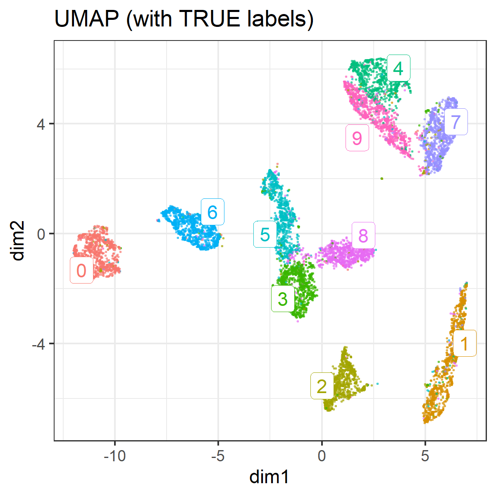
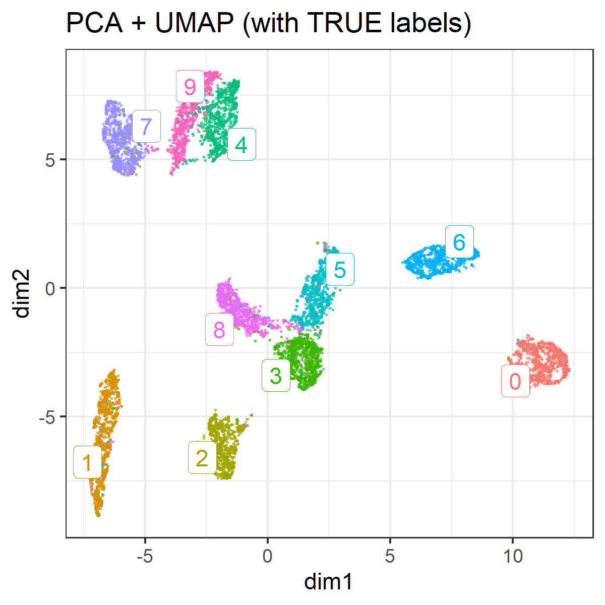
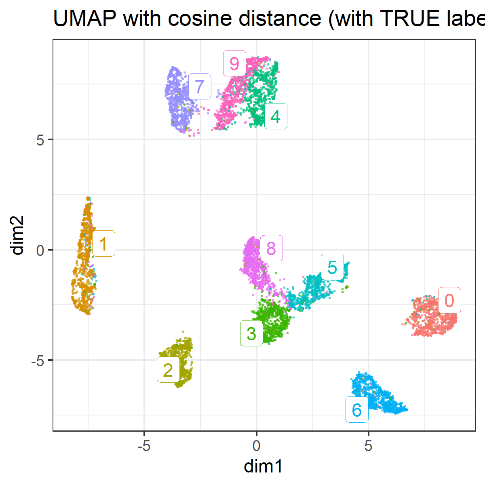
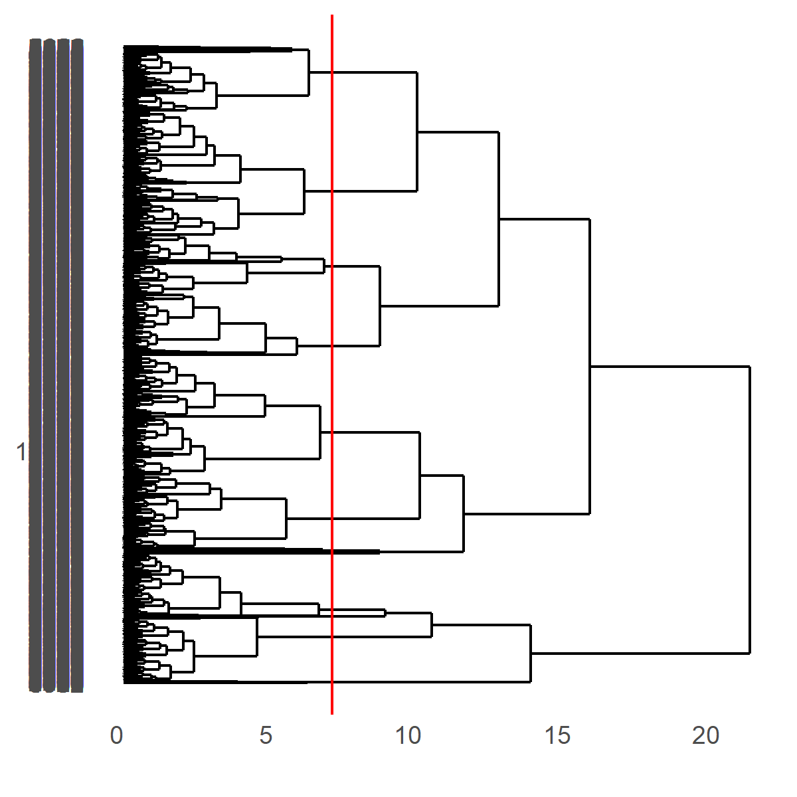
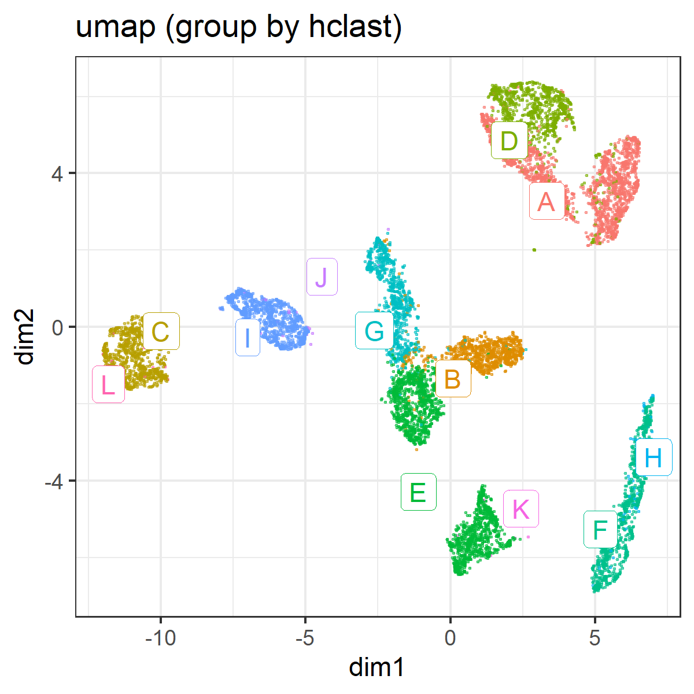
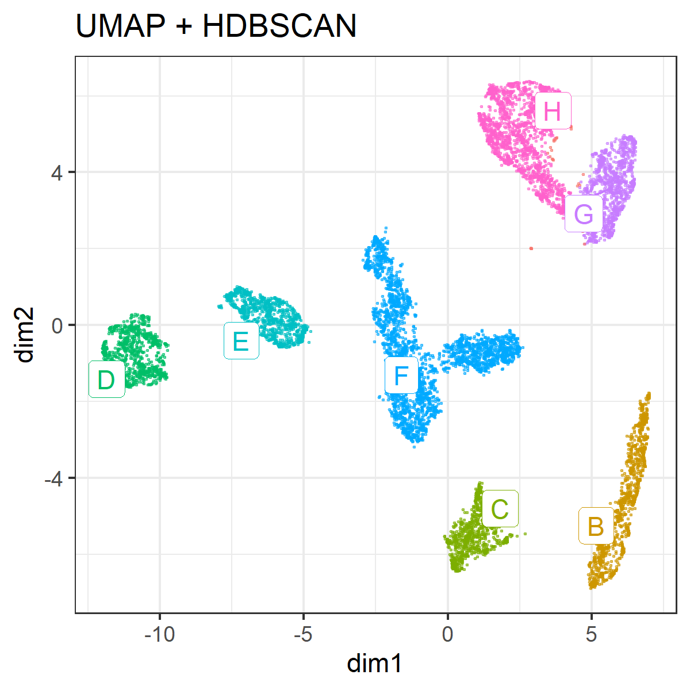

```{r setup, include=FALSE}
knitr::opts_knit$set(progress = TRUE, 
                     verbose  = TRUE, 
                     root.dir = ".")

knitr::opts_chunk$set(collapse = TRUE, 
                      comment = "#> ", 
                      message = TRUE, 
                      warning = FALSE, 
                      include = TRUE,
                      echo    = TRUE)

set.seed(1)
```

```{r install.requirements, eval = FALSE}
install.packages("Rtsne", dependencies = TRUE)
install.packages("uwot", dependencies = TRUE)
install.packages("ggdendro", dependencies = TRUE)
install.packages("ggrepel", dependencies = TRUE)
install.packages("dbscan", dependencies = TRUE)

```

```{r require.packages, message=FALSE}
require(tidyverse)
require(magrittr)
require(dbscan)

require(Rtsne)
require(uwot)
library(ggdendro)
require(ggrepel)

```

# Preparation 

Using MNIST (test set) as csv fromat was downloaded from :

https://github.com/pjreddie/mnist-csv-png

```{r}
set.seed(1)

require(tidyverse)
require(Rtsne)
load("./input/mnist_sample.rda")

train.label  <- mnist.sample[,  1]
train.matrix <- mnist.sample[, -1] %>% as.matrix

n <- NROW(train.matrix)
train.matrix %>% str(0)

```

# dimension reduction using UMAP

according to :
https://rdrr.io/cran/uwot/man/umap.html


## With no tune

```{r}
plot.umap <- function(.umap, label = NULL, title = "") {
  
  mapping.umap <- data.frame(
    id     = 1:NROW(.umap),
    dim1  = .umap[, 1],
    dim2  = .umap[, 2])
  
  ggp.umap <- mapping.umap %>% 
    ggplot(aes(x = dim1, y = dim2, colour = label)) + 
    geom_point(alpha = 0.5, size = 0.2) + 
    theme_bw() +
    guides(colour = FALSE) +
    labs(title = title)
  
  if(!is.null(label)){
    mapping.umap$label = as.factor(label)
    
    labels.cent <- mapping.umap %>% 
      dplyr::group_by(label) %>%
      select(dim1, dim2) %>% 
      summarize_all(mean)
    
    ggp.umap <- ggp.umap +
      ggrepel::geom_label_repel(data = labels.cent,
                                aes(label = label),
                                label.size = 0.1)
  }
  invisible(
    list(
      plot = ggp.umap,
      mapping = mapping.umap
    )
  )
}
```

```{r}
res.umap <- train.matrix %>% 
  uwot::umap(verbose = TRUE)

```

```{r}
res.umap <- train.matrix %>% 
  uwot::umap(verbose = TRUE, n_threads = 1)

```

```{r}
ggp.umap <- res.umap %>% 
  plot.umap(
    label = as.factor(train.label),
    title = "UMAP (with TRUE labels)" )
# ggp.umap$plot

ggsave(ggp.umap$plot, filename =  "./output/030_umap_unsupervised_with_label.png",
       height = 4, width = 4)

```




```{r}
res.umap.pca <- train.matrix %>% 
  uwot::umap(verbose = TRUE, pca = 50)

```

```{r}
ggp.umap.pca <- res.umap.pca %>% 
  plot.umap(
    label = as.factor(train.label),
    title = "PCA + UMAP (with TRUE labels)" )
# ggp.umap$plot

ggsave(ggp.umap.pca$plot, filename =  "./output/030_umap_unsupervised_with_pca.png",
       height = 4, width = 4)

```




```{r}
res.umap.cosine <- train.matrix %>% 
  uwot::umap(verbose = TRUE, metric = "cosine")

```

```{r}
ggp.umap.cosine <- res.umap.cosine %>% 
  plot.umap(
    label = as.factor(train.label),
    title = "UMAP with cosine distance (with TRUE labels)" )
# ggp.umap$plot

ggsave(ggp.umap.cosine$plot, filename =  "./output/030_umap_unsupervised_with_cosine.png",
       height = 4, width = 4)

```



# Hierarchical clustering

```{r }
mapping.umap.hc <- ggp.umap$mapping %>% 
  select(-id) %>% 
  as.matrix() %>% 
  dist() %>% 
  hclust()
mapping.umap.hc
```

## explore cut.off for cutree

```{r}
library(ggdendro)

cut.off = 7

ggdend.umap.hc <- ggdendrogram(mapping.umap.hc, rotate = TRUE, size = 2) +
  geom_hline(yintercept = cut.off, color = "red")

ggsave(ggdend.umap.hc, filename =  "./output/030_umap_hclust.png",
       height = 4, width = 4)

```



```{r}
require(ggrepel)

group.by.hclust <- mapping.umap.hc %>%
  cutree(h = cut.off)

ggp.umap.hc <- res.umap %>% 
  plot.umap(
    label = as.factor(LETTERS[group.by.hclust]),
    title = "umap (group by hclast)")

# ggp.umap.hc$plot
ggsave(ggp.umap.hc$plot, 
       filename =  "./output/030_umap_clustering_by_hclust.png",
       height = 4, width = 4)

```



## Hierarchical Density-based spatial clustering of applications with noise (HDBSCAN)

Reference:

https://hdbscan.readthedocs.io/en/latest/how_hdbscan_works.html

according to:

https://cran.r-project.org/web/packages/dbscan/vignettes/hdbscan.html

```{r}
# install.packages("dbscan", dependencies = TRUE)
require(dbscan)

```

`minPts` not only acts as a minimum cluster size to detect, but also as a "smoothing" factor of the density estimates implicitly computed from HDBSCAN.

```{r }
# res.umap %>% str
cl.hdbscan <- ggp.umap$mapping %>% 
  select(dim1, dim2) %>% 
  dbscan::hdbscan(minPts = 22)
cl.hdbscan

plot(cl.hdbscan, show_flat = TRUE)

```

```{r}
# install.packages("ggrepel", dependencies = TRUE)
require(ggrepel)

ggp.umap$mapping$hdbscan <- factor(cl.hdbscan$cluster)

hdbscan.cent <- ggp.umap$mapping %>% 
  filter(hdbscan != 0) %>% 
  dplyr::group_by(hdbscan) %>%
  select(dim1, dim2) %>% 
  summarize_all(mean)

ggp.umap.hdbscan <- ggp.umap$mapping %>% 
  ggplot(aes(x = dim1, y = dim2, colour = hdbscan)) + 
  geom_point(alpha = 0.5, size = 0.2) + 
  theme_bw() +
  ggrepel::geom_label_repel(data = hdbscan.cent, 
                            aes(label = LETTERS[hdbscan]),
                            label.size = 0.1) + 
  guides(colour = FALSE) + 
  labs(title = "UMAP + HDBSCAN") 

ggp.umap.hdbscan
ggsave(ggp.umap.hdbscan, 
       filename =  "./output/030_umap_clustering_by_hdbscan.png",
       height = 4, width = 4)

```



