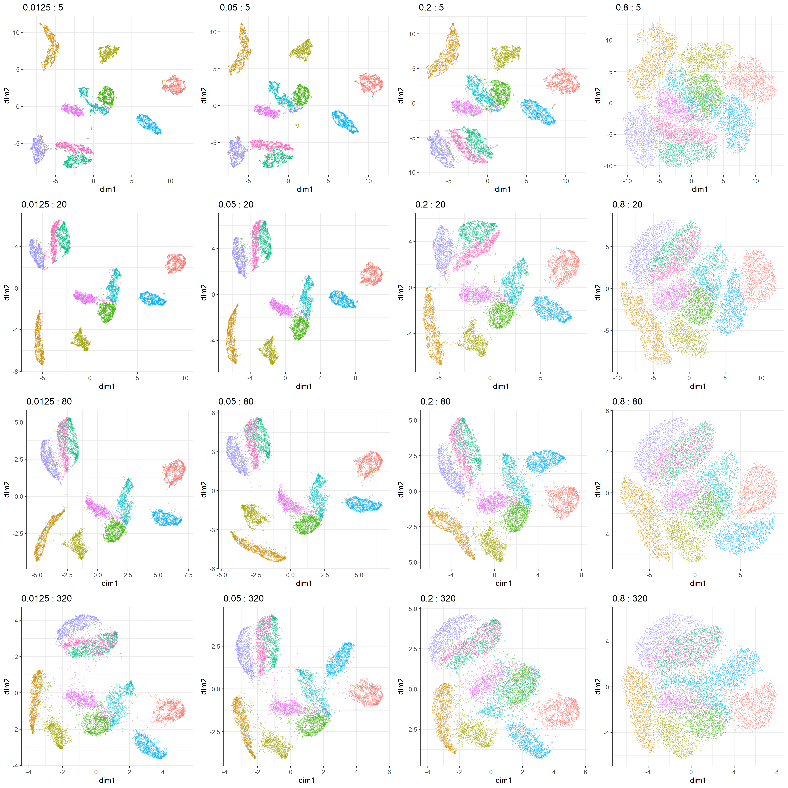

```{r setup, include=FALSE}
knitr::opts_knit$set(progress = TRUE, 
                     verbose  = TRUE, 
                     root.dir = ".")

knitr::opts_chunk$set(collapse = TRUE, 
                      comment = "#> ", 
                      message = TRUE, 
                      warning = FALSE, 
                      include = TRUE,
                      echo    = TRUE)

set.seed(1)
```

```{r install.requirements, eval = FALSE}
install.packages("Rtsne", dependencies = TRUE)
install.packages("uwot", dependencies = TRUE)
install.packages("ggdendro", dependencies = TRUE)
install.packages("ggrepel", dependencies = TRUE)

```

```{r require.packages, message=FALSE}
require(tidyverse)
require(magrittr)
require(xgboost)

require(Rtsne)
require(uwot)
library(ggdendro)
require(ggrepel)

```

# Preparation 

Using MNIST (test set) as csv fromat was downloaded from :

https://github.com/pjreddie/mnist-csv-png

```{r}
set.seed(1)

require(tidyverse)
require(Rtsne)
load("./input/mnist_sample.rda")

train.label  <- mnist.sample[,  1]
train.matrix <- mnist.sample[, -1] %>% as.matrix

n <- NROW(train.matrix)
train.matrix %>% str(0)

```

# dimension reduction using UMAP

according to :
https://rdrr.io/cran/uwot/man/umap.html


## With no tune

```{r}
plot.umap <- function(.umap, label = NULL, .colour = label, title = "") {
  
  mapping.umap <- data.frame(
    id     = 1:NROW(.umap),
    dim1  = .umap[, 1],
    dim2  = .umap[, 2])
  
  ggp.umap <- mapping.umap %>% 
    ggplot(aes(x = dim1, y = dim2, colour = .colour)) + 
    geom_point(alpha = 0.3, size = 0.2) + 
    theme_bw() +
    guides(colour = FALSE) +
    labs(title = title)
  
  if(!is.null(label)){
    mapping.umap$label = as.factor(train.label)
    
    labels.cent <- mapping.umap %>% 
      dplyr::group_by(label) %>%
      select(dim1, dim2) %>% 
      summarize_all(mean)
    
    ggp.umap <- ggp.umap +
      ggrepel::geom_label_repel(data = labels.cent,
                                aes(label = label),
                                label.size = 0.1)
  }
  invisible(
    list(
      plot = ggp.umap,
      mapping = mapping.umap
    )
  )
}
```


```{r}
pars <- expand.grid(min_dist = c(0.0125, 0.05, 0.2, 0.8),
                    n_neighbors = c(5, 20, 80, 320))
i = 1
res <- list(NULL)
for(i in 1:NROW(pars)) {
  title.txt <- sprintf("%s : %s",
                       as.character(pars$min_dist[i]), 
                       as.character(pars$n_neighbors[i]))
  cat(i, ": ", title.txt, "\n")
  res.umap <- train.matrix %>% 
    uwot::umap(verbose = TRUE, 
               n_threads = 7,
               min_dist = pars$min_dist[i],
               n_neighbors = pars$n_neighbors[i])

  ggp.umap <- res.umap %>% 
    plot.umap(title = title.txt, .colour = as.factor(train.label))
  
  res[[i]] <- ggp.umap$plot
}
res[[1]]
ggp.umap.compare <- gridExtra::arrangeGrob(
  grobs = res,
  ncol = 4
)
ggp.umap.compare
res %>% str(1)
ggsave(ggp.umap.compare, 
       filename =  "./output/040_umap_min_dist_vs_n_neighbors.png",
       height = 16, width = 16)


```




