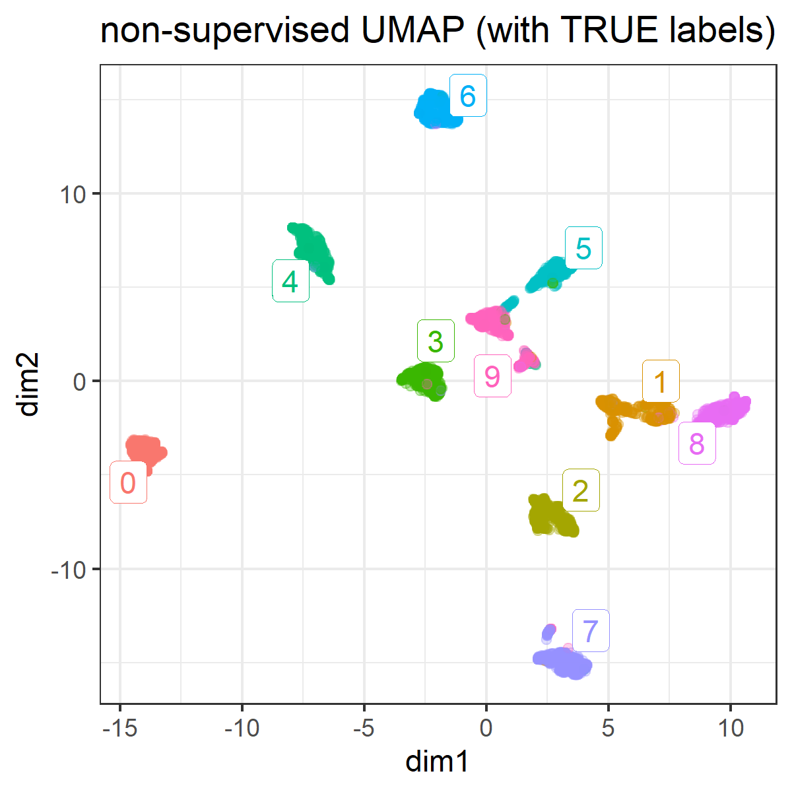
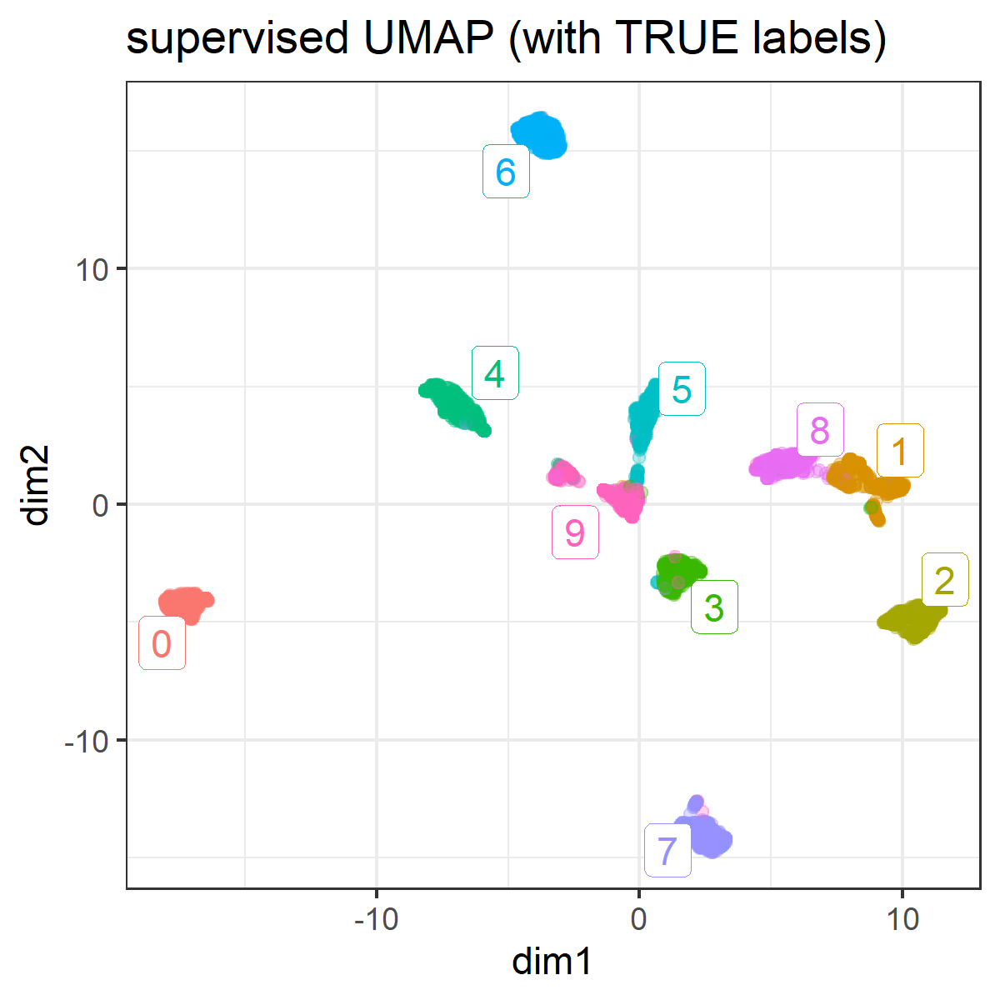
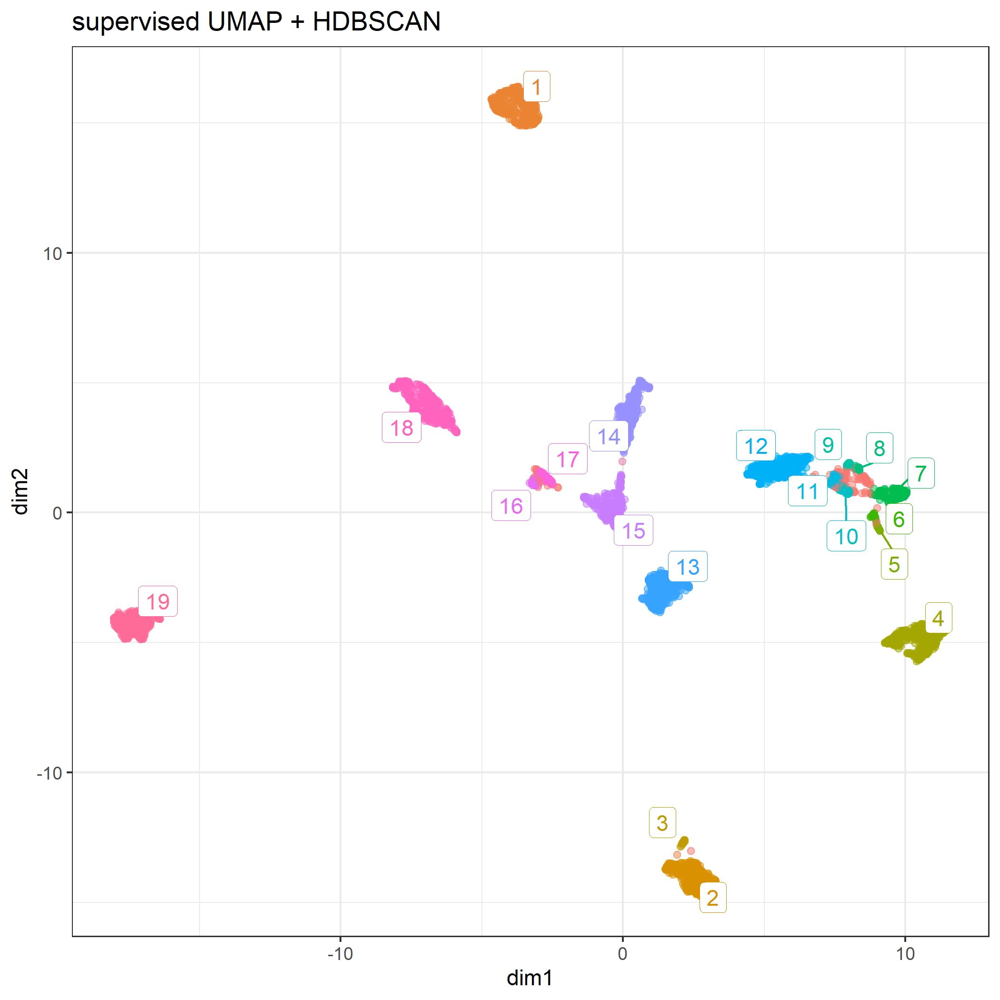

```{r setup, include=FALSE}
knitr::opts_knit$set(progress = TRUE, 
                     verbose  = TRUE, 
                     root.dir = ".")

knitr::opts_chunk$set(collapse = TRUE, 
                      comment = "", 
                      message = TRUE, 
                      warning = FALSE, 
                      include = TRUE,
                      echo    = TRUE)

set.seed(1)
```

```{r install.requirements, eval = FALSE}
install.packages("Rtsne", dependencies = TRUE)
install.packages("uwot", dependencies = TRUE)
install.packages("ggdendro", dependencies = TRUE)
install.packages("ggrepel", dependencies = TRUE)

```

```{r require.packages, message=FALSE}
require(tidyverse)
require(magrittr)
require(xgboost)

require(Rtsne)
require(uwot)
library(ggdendro)
require(ggrepel)

```

# Preparation 

Optical Recognition of Handwritten Digits Data Set

https://archive.ics.uci.edu/ml/datasets/Optical+Recognition+of+Handwritten+Digits

```{r load.data}
optdigits.tra  <- read.table("./input/optdigits.tra.csv", sep = ",", header = FALSE)

train.label  <- optdigits.tra[, 65]
train.matrix <- optdigits.tra[, -65] %>% as.matrix

```

## dimension reduction using UMAP

according to :
https://rdrr.io/cran/uwot/man/umap.html


# With no option
```{r}
plot.umap <- function(.umap, label = NULL, title = "") {
  
  mapping.umap <- data.frame(
    id     = 1:NROW(optdigits.umap),
    dim1  = optdigits.umap[, 1],
    dim2  = optdigits.umap[, 2])
  
  ggp.umap <- mapping.umap %>% 
    ggplot(aes(x = dim1, y = dim2, colour = label)) + 
    geom_point(alpha = 0.3) + 
    theme_bw() +
    guides(colour = FALSE) +
    labs(title = title)
  
  if(!is.null(label)){
    mapping.umap$label = as.factor(train.label)
    
    labels.cent <- mapping.umap %>% 
      dplyr::group_by(label) %>%
      select(dim1, dim2) %>% 
      summarize_all(mean)
    
    ggp.umap <- ggp.umap +
      ggrepel::geom_label_repel(data = labels.cent,
                                aes(label = label),
                                label.size = 0.1)
  }
  invisible(
    list(
      plot = ggp.umap,
      mapping = mapping.umap
    )
  )
}
```

```{r}
optdigits.umap <- train.matrix %>% 
  uwot::umap()

ggp.umap <- optdigits.umap %>% 
  plot.umap(
    label = as.factor(train.label),
    title = "non-supervised UMAP (with TRUE labels)" )
# 
ggsave(ggp.umap$plot, filename =  "./output/010_umap_unsupervised_with_label.png",
       height = 5, width = 5)

```



### supervised dimension reduction

```{r}
optdigits.sumap <- train.matrix %>% 
  uwot::umap(y = train.label)

ggp.sumap <- optdigits.sumap %>% 
  plot.umap(
    label = as.factor(train.label),
    title = "supervised UMAP (with TRUE labels)" )
# 
ggsave(ggp.sumap$plot, filename =  "./output/010_umap_supervised_with_label.png",
       height = 5, width = 5)

```



## Hierarchical Density-based spatial clustering of applications with noise (HDBSCAN)

Reference:

https://hdbscan.readthedocs.io/en/latest/how_hdbscan_works.html

according to:

https://cran.r-project.org/web/packages/dbscan/vignettes/hdbscan.html

```{r}
# install.packages("dbscan", dependencies = TRUE)
require(dbscan)

```

`minPts` not only acts as a minimum cluster size to detect, but also as a "smoothing" factor of the density estimates implicitly computed from HDBSCAN.

```{r }
# mapping.sumap %>% str
cl.hdbscan <- mapping.sumap %>% 
  select(dim1, dim2) %>% 
  hdbscan()
cl.hdbscan

plot(cl.hdbscan, show_flat = TRUE)

```

```{r}
# install.packages("ggrepel", dependencies = TRUE)
require(ggrepel)

mapping.sumap$hdbscan <- factor(cl.hdbscan$cluster)

hdbscan.cent <- mapping.sumap %>% 
  filter(hdbscan != 0) %>% 
  dplyr::group_by(hdbscan) %>%
  select(dim1, dim2) %>% 
  summarize_all(mean)

ggp.sumap.hdbscan <- mapping.sumap %>% 
  ggplot(aes(x = dim1, y = dim2, colour = hdbscan)) + 
  geom_point(alpha = 0.3) + 
  theme_bw() +
  ggrepel::geom_label_repel(data = hdbscan.cent, 
                            aes(label = hdbscan),
                            label.size = 0.1) + 
  guides(colour = FALSE) + 
  labs(title = "supervised UMAP + HDBSCAN") 


ggsave(ggp.sumap.hdbscan, filename =  "./output/010_map_sumap_hdbscan.png",
       height = 7, width = 7)

```



