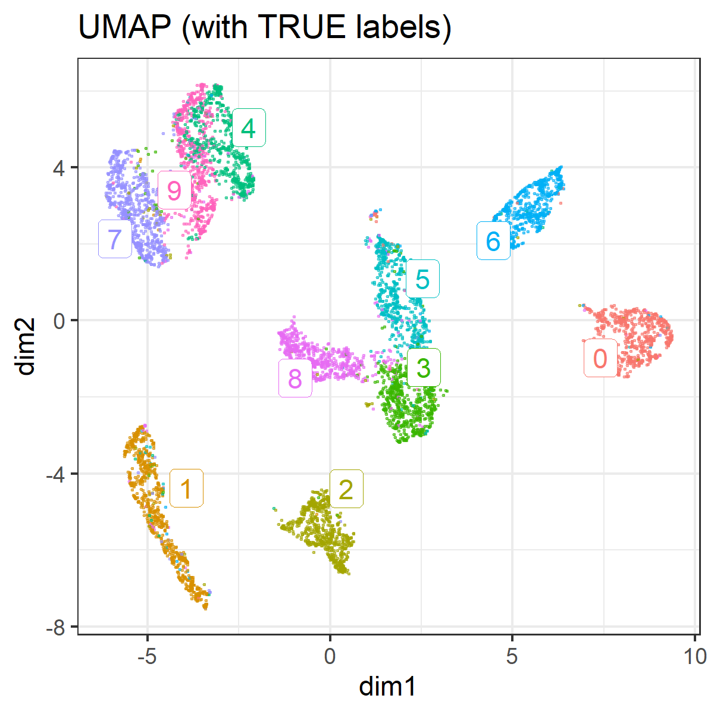
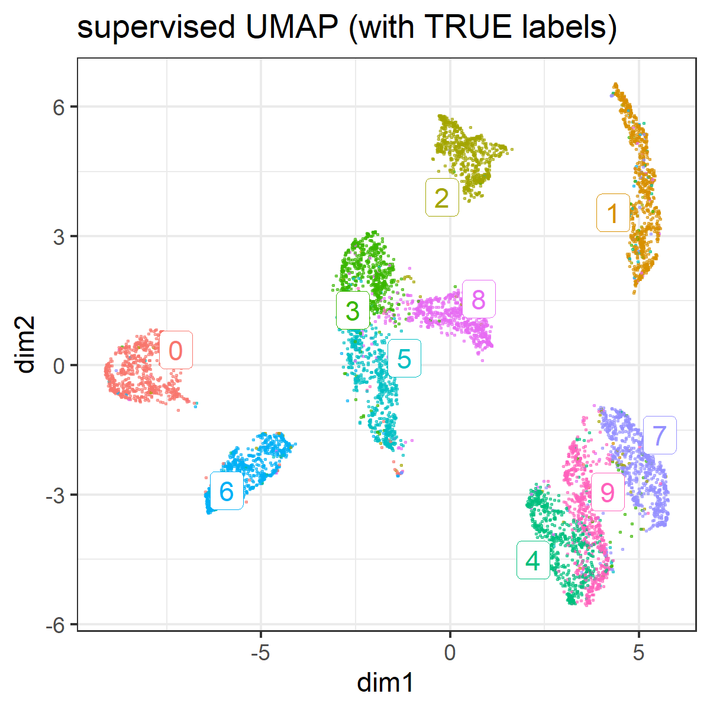
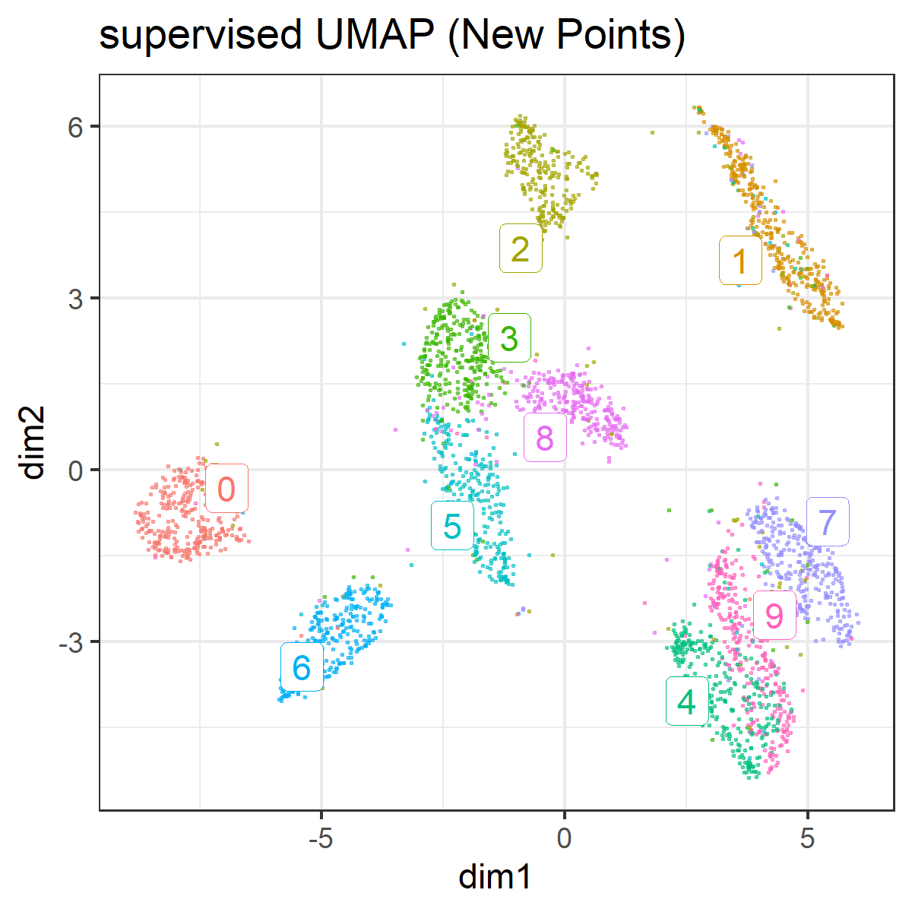

```{r setup, include=FALSE}
knitr::opts_knit$set(progress = TRUE, 
                     verbose  = TRUE, 
                     root.dir = ".")

knitr::opts_chunk$set(collapse = TRUE, 
                      comment = "", 
                      message = TRUE, 
                      warning = FALSE, 
                      include = TRUE,
                      echo    = TRUE)

set.seed(1)
```

```{r install.requirements, eval = FALSE}
install.packages("Rtsne", dependencies = TRUE)
install.packages("uwot", dependencies = TRUE)
install.packages("ggdendro", dependencies = TRUE)
install.packages("ggrepel", dependencies = TRUE)

```

```{r require.packages, message=FALSE}
require(tidyverse)
require(magrittr)

require(Rtsne)
require(uwot)
library(ggdendro)
require(ggrepel)

```

# Preparation 

Using MNIST (test set) as csv fromat was downloaded from :

https://github.com/pjreddie/mnist-csv-png

```{r}
set.seed(1)

require(tidyverse)
require(Rtsne)
load("./input/mnist_sample.rda")

train.label  <- mnist.sample[1:7000,  1]
train.matrix <- mnist.sample[1:7000, -1] %>% as.matrix

test.label  <- mnist.sample[-c(1:7000),  1]
test.matrix <- mnist.sample[-c(1:7000), -1] %>% as.matrix

train.matrix %>% str(0)
test.matrix %>% str(0)

```

# dimension reduction using UMAP

according to :
https://rdrr.io/cran/uwot/man/umap.html


## With no tune

```{r}
plot.umap <- function(.umap, label = NULL, title = "") {
  
  mapping.umap <- data.frame(
    id     = 1:NROW(.umap),
    dim1  = .umap[, 1],
    dim2  = .umap[, 2])
  
  ggp.umap <- mapping.umap %>% 
    ggplot(aes(x = dim1, y = dim2, colour = label)) + 
    geom_point(alpha = 0.5, size = 0.2) + 
    theme_bw() +
    guides(colour = FALSE) +
    labs(title = title)
  
  if(!is.null(label)){
    mapping.umap$label = as.factor(label)
    
    labels.cent <- mapping.umap %>% 
      dplyr::group_by(label) %>%
      select(dim1, dim2) %>% 
      summarize_all(mean)
    
    ggp.umap <- ggp.umap +
      ggrepel::geom_label_repel(data = labels.cent,
                                aes(label = label),
                                label.size = 0.1)
  }
  invisible(
    list(
      plot = ggp.umap,
      mapping = mapping.umap
    )
  )
}
```

```{r}
res.umap <- train.matrix %>% 
  uwot::umap(verbose = TRUE)

```

```{r}
ggp.umap <- res.umap %>% 
  plot.umap(
    label = as.factor(train.label),
    title = "UMAP (with TRUE labels)" )
# ggp.umap$plot

ggsave(ggp.umap$plot, filename =  "./output/050_umap_with_label.png",
       height = 4, width = 4)

```



# Supervised Embedding

https://jlmelville.github.io/uwot/metric-learning.html

```{r}
res.sumap <- train.matrix %>% 
  uwot::umap(verbose = TRUE, y = train.label)

ggp.sumap <- res.sumap %>% 
  plot.umap(
    label = as.factor(train.label),
    title = "supervised UMAP (with TRUE labels)" )
# 
ggsave(ggp.sumap$plot, filename =  "./output/050_umap_supervised_embed.png",
       height = 4, width = 4)

```




# Metric Learning

https://jlmelville.github.io/uwot/metric-learning.html

```{r}
res.sumap.train <- train.matrix %>% 
  uwot::umap(verbose = TRUE, y = train.label, ret_model = TRUE)
res.sumap.train %>% str(2)

res.sumap.test <- umap_transform(test.matrix, model = res.sumap.train, verbose = TRUE)
res.sumap.test %>% str(2)

```


```{r}
  ggp.sumap <- res.sumap.test %>% 
  plot.umap(
    label = as.factor(test.label),
    title = "supervised UMAP (New Points)" )
# 
ggsave(ggp.sumap$plot, filename =  "./output/050_umap_metric_learn_predict_test.png",
       height = 4, width = 4)

```




