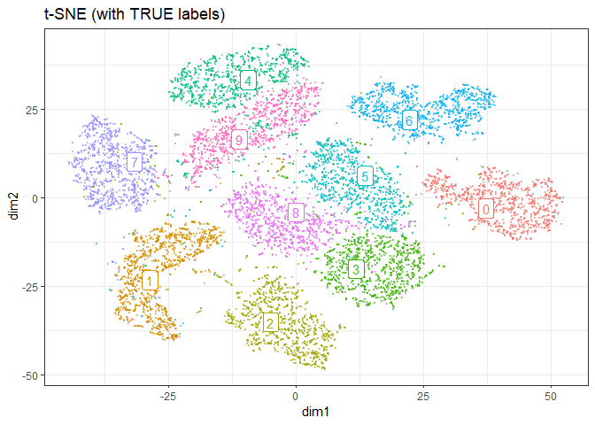

```r
install.packages("Rtsne", dependencies = TRUE)
install.packages("uwot", dependencies = TRUE)
install.packages("ggdendro", dependencies = TRUE)
install.packages("ggrepel", dependencies = TRUE)

```


```r
require(tidyverse)
require(magrittr)

require(Rtsne)
require(uwot)
library(ggdendro)
require(ggrepel)
```

# Preparation 


Using MNIST (test set) as csv fromat was downloaded from :

https://github.com/pjreddie/mnist-csv-png


```r
set.seed(1)

require(tidyverse)
require(Rtsne)
load("./input/mnist_sample.rda")

train.label  <- mnist.sample[,  1]
train.matrix <- mnist.sample[, -1] %>% as.matrix

n <- NROW(train.matrix)
train.matrix %>% str(0)
#>   int [1:10000, 1:784] 0 0 0 0 0 0 0 0 0 0 ...
#>   - attr(*, "dimnames")=List of 2
```

# dimension reduction using t-SNE

according to :
http://jmonlong.github.io/Hippocamplus/2017/12/02/tsne-and-clustering/


```r
zeros.col <- which(colSums(train.matrix) == 0)
map.pca <- prcomp(x = train.matrix[, -zeros.col], scale = TRUE)
ggp.pca <- data.frame(
  dim1  = map.pca$x[, 1],
  dim2  = map.pca$x[, 2],
  label = as.factor(train.label)) %>% 
  ggplot(aes(x = dim1, y = dim2, colour = label)) + 
  geom_point(alpha = 0.3, size = 0.2) + 
  theme_bw() +
  guides(colour = FALSE) +
  labs(title = "PCA")

ggsave(ggp.pca, filename =  "./output/000_PCA.png",
       height = 4, width = 4)
```


```r
plot.tsne <- function(.tsne, label = NULL, title = "") {
  
  mapping <- data.frame(
    id    = 1:NROW(.tsne$Y),
    dim1  = .tsne$Y[, 1],
    dim2  = .tsne$Y[, 2])
  
  ggp <- mapping %>% 
    ggplot(aes(x = dim1, y = dim2, colour = label)) + 
    geom_point(alpha = 0.5, size = 0.2) + 
    theme_bw() +
    guides(colour = FALSE) +
    labs(title = title)
  
  if(!is.null(label)){
    mapping$label = label
    
    labels.cent <- mapping %>% 
      dplyr::group_by(label) %>%
      select(dim1, dim2) %>% 
      summarize_all(mean)
    
    ggp <- ggp +
      ggrepel::geom_label_repel(data = labels.cent,
                                aes(label = label),
                                label.size = 0.1)
  }
  
  invisible(
    list(
      plot = ggp,
      mapping = mapping
    )
  )
}
```


```r
mapping.tsne <- train.matrix %>% 
  Rtsne::Rtsne(verbose = TRUE, num_threads = 4)
#>  Performing PCA
#>  Read the 10000 x 50 data matrix successfully!
#>  OpenMP is working. 4 threads.
#>  Using no_dims = 2, perplexity = 30.000000, and theta = 0.500000
#>  Computing input similarities...
#>  Building tree...
#>   - point 10000 of 10000
#>  Done in 4.49 seconds (sparsity = 0.012240)!
#>  Learning embedding...
#>  Iteration 50: error is 97.591196 (50 iterations in 1.17 seconds)
#>  Iteration 100: error is 90.564007 (50 iterations in 1.78 seconds)
#>  Iteration 150: error is 86.289766 (50 iterations in 1.29 seconds)
#>  Iteration 200: error is 85.959810 (50 iterations in 1.32 seconds)
#>  Iteration 250: error is 85.910015 (50 iterations in 1.29 seconds)
#>  Iteration 300: error is 3.131837 (50 iterations in 1.23 seconds)
#>  Iteration 350: error is 2.716648 (50 iterations in 1.12 seconds)
#>  Iteration 400: error is 2.497468 (50 iterations in 1.09 seconds)
#>  Iteration 450: error is 2.355725 (50 iterations in 1.12 seconds)
#>  Iteration 500: error is 2.254022 (50 iterations in 1.14 seconds)
#>  Iteration 550: error is 2.176740 (50 iterations in 1.13 seconds)
#>  Iteration 600: error is 2.115328 (50 iterations in 1.12 seconds)
#>  Iteration 650: error is 2.066867 (50 iterations in 1.24 seconds)
#>  Iteration 700: error is 2.027932 (50 iterations in 1.07 seconds)
#>  Iteration 750: error is 1.997236 (50 iterations in 1.05 seconds)
#>  Iteration 800: error is 1.973363 (50 iterations in 1.11 seconds)
#>  Iteration 850: error is 1.954827 (50 iterations in 1.14 seconds)
#>  Iteration 900: error is 1.940644 (50 iterations in 1.35 seconds)
#>  Iteration 950: error is 1.930548 (50 iterations in 1.34 seconds)
#>  Iteration 1000: error is 1.922949 (50 iterations in 1.11 seconds)
#>  Fitting performed in 24.20 seconds.
```

```r
mapping.tsne %>% str()
#>  List of 14
#>   $ N                  : int 10000
#>   $ Y                  : num [1:10000, 1:2] -13.5 -32.11 4.76 37.04 -32.26 ...
#>   $ costs              : num [1:10000] 1.76e-04 1.57e-04 1.60e-04 9.39e-05 1.14e-04 ...
#>   $ itercosts          : num [1:20] 97.6 90.6 86.3 86 85.9 ...
#>   $ origD              : int 50
#>   $ perplexity         : num 30
#>   $ theta              : num 0.5
#>   $ max_iter           : num 1000
#>   $ stop_lying_iter    : int 250
#>   $ mom_switch_iter    : int 250
#>   $ momentum           : num 0.5
#>   $ final_momentum     : num 0.8
#>   $ eta                : num 200
#>   $ exaggeration_factor: num 12
```


```r
mapping <- data.frame(
  id    = 1:NROW(mapping.tsne$Y),
  dim1  = mapping.tsne$Y[, 1],
  dim2  = mapping.tsne$Y[, 2],
  label = as.factor(train.label))

ggp <- mapping %>% 
  ggplot(aes(x = dim1, y = dim2, colour = label)) + 
  geom_point(alpha = 0.5, size = 0.2) + 
  theme_bw() +
  guides(colour = FALSE) +
  labs(title = "t-SNE (with TRUE labels)")

labels.cent <- mapping %>% 
  dplyr::group_by(label) %>%
  select(dim1, dim2) %>% 
  summarize_all(mean)
#>  Adding missing grouping variables: `label`
    
ggp.tsne <- ggp +
  ggrepel::geom_label_repel(
    data = labels.cent,
    aes(label = label),
    label.size = 0.1)

ggp.tsne
```

<!-- -->

```r

ggsave(ggp.tsne, filename =  "./output/000_t-SNE.png",
       height = 4, width = 4)
```


```r
ggp.tsne.nolabel <- mapping.tsne %>% 
  plot.tsne(
    # label = as.factor(train.label),
    title = "t-SNE (without labels)")
# mapping.tsne %>% str
# ggp.tsne.nolabel$plot

ggsave(ggp.tsne.nolabel$plot, filename =  "./output/000_t-SNE_nolabel.png",
       height = 4, width = 4)
```


# Hierarchical clustering


```r
mapping.tsne.hc <- ggp.tsne.nolabel$mapping %>% 
  select(-id) %>% 
  as.matrix() %>% 
  dist() %>% 
  hclust()
mapping.tsne.hc
#>  
#>  Call:
#>  hclust(d = .)
#>  
#>  Cluster method   : complete 
#>  Distance         : euclidean 
#>  Number of objects: 10000
```

## explore cut.off for cutree


```r
library(ggdendro)

cut.off = 27

ggdend.tsne.hc <- ggdendrogram(mapping.tsne.hc, rotate = TRUE, size = 2) +
  geom_hline(yintercept = cut.off, color = "red")

ggsave(ggdend.tsne.hc, filename =  "./output/000_tsne_hclust.png",
       height = 4, width = 4)

group.by.hclust <- mapping.tsne.hc %>%
  cutree(h = cut.off) %>%
  factor()

```


```r
ggp.tsne.hc <- mapping.tsne %>% 
  plot.tsne(
    label = as.factor(LETTERS[group.by.hclust]),
    title = "t-SNE (group by hclust)")
#>  Adding missing grouping variables: `label`

# ggp.tsne.hc$plot
```


```r
ggp.tsne.compare <- gridExtra::arrangeGrob(
  grobs = list(
    ggp.tsne, ggp.tsne.hc$plot
  ),
  ncol = 2
)

ggsave(ggp.tsne.compare, filename =  "./output/000_t-SNE_compare.png",
       height = 4, width = 8)
```


